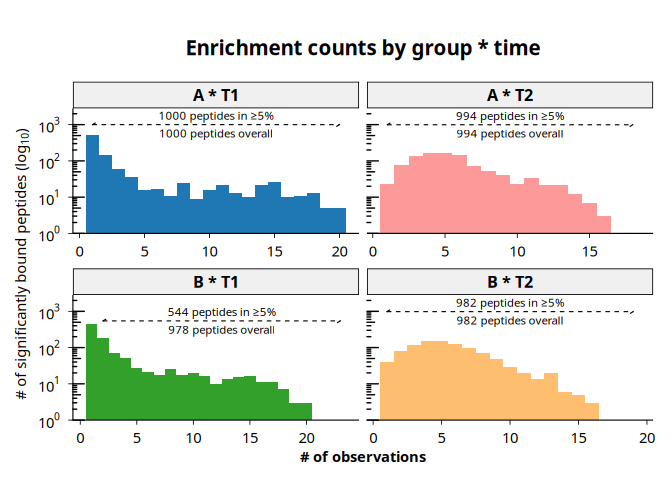
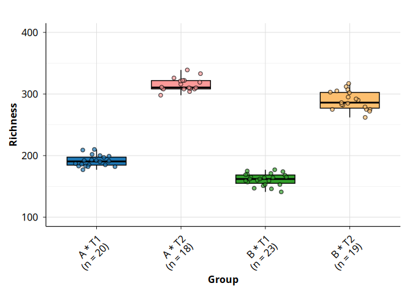

<!-- README.md is generated from README.Rmd. Please edit that file -->

<!-- badges: start -->

[](https://app.codecov.io/gh/Polymerase3/phiper)
[](https://github.com/Polymerase3/phiper/actions/workflows/R-CMD-check.yaml)
[](https://github.com/Polymerase3/phiper/actions?query=workflow%3Apkgcheck)
[](https://www.repostatus.org/#active)
[](https://lifecycle.r-lib.org/articles/stages.html#experimental)

<!-- badges: end -->

# phiper

The `phiper` package provides a scalable, reproducible toolkit for
validating and analyzing PhIP-Seq data in cross-sectional and
longitudinal studies.

## Installation

You can install the development version of `phiper` from GitHub with
either `pak` or `devtools`:

``` r
# install.packages("pak")
pak::pak("Polymerase3/phiper")

# or, using devtools:
# install.packages("devtools")
devtools::install_github("Polymerase3/phiper")
```

## Minimal example

For testing, exploration, and minimal examples we provide the
`phip_mixture` dataset. It is a simulated PhIP-Seq–like antibody
repertoire for two groups (A, B) and two time points (T1, T2), with
per-subject, per-peptide presence/absence (`exist`) plus corresponding
read counts and fold changes. The dataset is generated from a simple
mixture of rare and common peptide prevalences with Poisson-distributed
counts and is intended solely for testing and illustrative examples,
without any biological interpretation.

### Importing the data

Because the data are relatively large, they are stored in a `.parquet`
file. You can obtain the file path with:

``` r
library(phiper)
library(dplyr)
library(ggplot2)

phip_path <- phip_example_path()
```

You can then import the data with:

``` r
ps <- phip_convert(
  data_long_path    = phip_path,
  backend           = "duckdb",
  peptide_library   = TRUE,
  subject_id        = "subject_id",
  peptide_id        = "peptide_id",
  sample_id         = "sample_id",
  exist             = "exist",
  timepoint         = "timepoint_factor",
  fold_change       = "fold_change",
  materialise_table = TRUE,
  auto_expand       = FALSE,
  n_cores           = 5
)
```

You can inspect the data:

``` r
ps$data_long %>%
  head(5) %>%
  collect()
#> # A tibble: 5 × 9
#>   sample_id subject_id group time  peptide_id exist counts_control counts_hits
#>   <chr>     <chr>      <chr> <chr> <chr>      <int>          <int>       <int>
#> 1 A_T1_1    1          A     T1    10003          1              5        1031
#> 2 A_T1_1    1          A     T1    10017          1             37         494
#> 3 A_T1_1    1          A     T1    10023          1             11        3015
#> 4 A_T1_1    1          A     T1    10062          1              0        3499
#> 5 B_T1_1    1          B     T1    10087          1              1        1245
#> # ℹ 1 more variable: fold_change <dbl>
```

You can also inspect the current version of the peptide library
maintained by the Vogl lab:

``` r
get_peptide_library(ps) %>%
  head(5) %>%
  collect()
#> # A tibble: 5 × 30
#>   peptide_id aa_seq    pos len_seq Fullname Description is_IEDB_or_cntrl is_auto
#>   <chr>      <chr>   <dbl>   <dbl> <chr>    <chr>       <lgl>            <lgl>  
#> 1 agilent_1  AAAAAA…  2728    2997 Chromod… Chromodoma… TRUE             TRUE   
#> 2 agilent_2  AAAAYA…    88     445 integra… Uncharacte… TRUE             FALSE  
#> 3 agilent_3  AAADRS…   264     548 hypothe… Possible c… TRUE             FALSE  
#> 4 agilent_4  AAAIAW…  1276    3432 envelop… Genome pol… TRUE             FALSE  
#> 5 agilent_5  AAALRK…  1188    1935 Myosin-… Myosin-7    TRUE             FALSE  
#> # ℹ 22 more variables: is_infect <lgl>, is_EBV <lgl>, is_toxin <lgl>,
#> #   is_PNP <lgl>, is_EM <lgl>, is_MPA <lgl>, is_patho <lgl>, is_probio <lgl>,
#> #   is_IgA <lgl>, is_flagellum <lgl>, signalp6_slow <lgl>,
#> #   is_topgraph_new <lgl>, is_allergens <lgl>, domain <chr>, kingdom <chr>,
#> #   phylum <chr>, class <chr>, order <chr>, family <chr>, genus <chr>,
#> #   species <chr>, common <chr>
```

### Plotting peptide counts

You can easily plot peptide counts using the `plot_enrichment_counts()`
function:

``` r
plot_enrichment_counts(
  ps,
  group_cols        = c("group", "time"),
  group_interaction = TRUE,
  interaction_only  = TRUE,
  annotation_size   = 3
)
#> [15:36:06] INFO  Plotting enrichment counts (<phip_data>)
#>                  -> group_cols: 'group', 'time'
#> [15:36:06] INFO  building enrichment count plot
#>                  -> grouping variable: '..phip_interaction..'
#> [15:36:06] OK    plot built
#> [15:36:06] OK    building enrichment count plot - done
#>                  -> elapsed: 0.147s
#> [15:36:06] OK    Plotting enrichment counts (<phip_data>) - done
#>                  -> elapsed: 0.151s
```



### Alpha diversity

You can also compute and visualize alpha diversity for different groups
or subgroups of interest. `phiper` is organized into analysis modules:
for each module you typically get a computation function (for example,
`compute_alpha_diversity()`) and one or more plotting functions (for
example, `plot_alpha_diversity()`). This pattern repeats across the
analysis modules.

For alpha diversity specifically:

``` r
alpha <- compute_alpha_diversity(
  ps,
  group_cols        = c("group", "time"),
  carry_cols        = "subject_id",
  group_interaction = TRUE,
  interaction_only  = TRUE
)
#> [15:36:07] INFO  Peptide library attached on main connection
#>                    - available columns: peptide_id, aa_seq, pos, len_seq,
#>                      Fullname, Description, is_IEDB_or_cntrl, is_auto …(+22)
#> [15:36:07] INFO  Computing alpha diversity (<phip_data>)
#>                  -> group_cols: 'group', 'time'; ranks: 'peptide_id'
#> [15:36:07] OK    Computing alpha diversity (<phip_data>) - done
#>                  -> elapsed: 0.115s

head(alpha)
#> $`group * time`
#> # A tibble: 80 × 7
#>    rank       sample_id phip_interaction subject_id richness simpson_diversity
#>    <chr>      <chr>     <chr>            <chr>         <int>             <dbl>
#>  1 peptide_id B_T2_1    B * T2           1               262             0.996
#>  2 peptide_id A_T1_14   A * T1           14              209             0.995
#>  3 peptide_id B_T1_15   B * T1           15              165             0.994
#>  4 peptide_id B_T1_17   B * T1           17              146             0.993
#>  5 peptide_id B_T2_17   B * T2           17              285             0.996
#>  6 peptide_id B_T1_20   B * T1           20              170             0.994
#>  7 peptide_id B_T1_22   B * T1           22              177             0.994
#>  8 peptide_id B_T1_23   B * T1           23              157             0.994
#>  9 peptide_id A_T1_5    A * T1           5               192             0.995
#> 10 peptide_id B_T2_8    B * T2           8               275             0.996
#> # ℹ 70 more rows
#> # ℹ 1 more variable: shannon_diversity <dbl>
```

You can then plot the results:

``` r
plot_alpha_diversity(
  alpha,
  metric    = "richness",
  group_col = "phip_interaction"
) +
  ylim(100, 400) +
  theme(
    axis.text.x = element_text(
      angle = 45,
      vjust = 1,
      hjust = 1
    )
  )
#> [15:36:07] INFO  plotting alpha diversity (precomputed)
#>                  -> metric: richness
#> [15:36:07] OK    plotting alpha diversity (precomputed) - done
#>                  -> elapsed: 0.071s
```



## Contributing

Bug reports, feature requests, and questions are welcome. Please open an
issue on the GitHub tracker:

- <https://github.com/Polymerase3/phiper/issues>

If you would like to contribute code:

1.  Fork the repository and create a feature branch.
2.  Make your changes, including tests and documentation where
    appropriate.
3.  Ensure that `R CMD check` passes locally (or via GitHub Actions).
4.  Open a pull request describing the changes and their motivation.

We are happy to review contributions and discuss design choices in the
issue tracker or pull requests.
