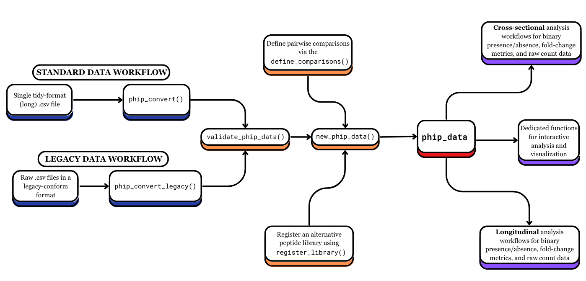

# phiper

<!-- badges: start -->

[](https://app.codecov.io/gh/Polymerase3/phiper) 
[](https://github.com/Polymerase3/phiper/actions/workflows/R-CMD-check.yaml)
[](https://github.com/Polymerase3/phiper/actions/workflows/style.yaml)
[](https://github.com/Polymerase3/phiper/actions/workflows/document.yaml)

<!-- badges: end -->

## Installation

You can install the development version of phiper from [GitHub](https://github.com/) with:

``` r
# install.packages("pak")
pak::pak("Polymerase3/phiper")

# install.packages("devtools")
devtools::install_github("Polymerase3/phiper")
```

## `phiper` Workflow

`phiper` provides a clean, simple, and sustainable end-to-end pipeline - from raw CSVs to ready-to-analyze objects. The package supports two parallel import paths:

1. **Standard workflow** (recommended)
   - Input: **one** long-format, tidy CSV file.
   - Import function: `phip_convert()` --> to be implemented

2. **Legacy workflow** (maintained for backwards compatibility)
   - Input: **three or four** separate CSV files (or a `config.yaml`).
   - Import function: `phip_convert_legacy()`

Both functions:

  - **Validate** inputs with `validate_phip_data()` (ensuring required columns, data integrity, unique keys, and more).
  - **Construct** the S3 object using `new_phip_data()` constructor.

Optionally, users can:

  - **Define pairwise comparisons** via `define_comparisons()` (to be implemented) or by supplying a comparison CSV.
  - **Register custom peptide libraries** with `register_library()` (to be implemented).

Once the `phip_data` object is created, you can:

  - Run **cross-sectional** analyses (binary presence/absence, fold-change, raw counts).
  - Run **longitudinal** analyses (same outcomes over time points).
  - Explore data interactively with built-in plotting and summarization tools.

Below is a flowchart illustrating the `phiper` workflow:



## `phip_data` - one object to rule them all

`phip_data` is the cornerstone of **phiper**.\
It is an S3 class that bundles together every piece of information you need for a PhIP-Seq analysis - raw or processed readouts, experimental design, current peptide‐library annotations maintained by the Vogl Lab, and even the strategy (backend) that is used to keep the data on disk or in memory.\
Because everything is stored in a single, well-validated object you can pipe it straight into downstream analyses, share it with collaborators, and reload it later without guessing which spreadsheet goes with which metadata file.

------------------------------------------------------------------------

### Anatomy of a `phip_data` object

| slot | what it holds | details & tips |
|----------------|---------------------------|-----------------------------|
| **`data_long`** | *Tidy* counts, binary hits or fold_changes for every peptide x sample pair | Must follow the principles  Wickham’s “Tidy Data”: one observation per row and one variable per column. Behind the scenes you can choose three interchangeable backends:<br>• **`duckdb`** (default) - blazing-fast, zero‑config SQL engine that works entirely in a temporary file. Ideal for millions of rows.<br>• **`arrow`** - columnar storage; especially good when you plan to move the data between R and Python.<br>• **`memory`** - a plain `data.frame`; fine for ≤ 250 k rows where start‑up overhead matters more than throughput. |
| **`comparisons`** | Named, two-way contrasts you intend to run | Each row describes one comparison (`group1` vs `group2` for a `variable`, e.g. a time‑point or phenotype). Constructors and helpers will land in a future release. |
| **`backend`** | Single string (`"duckdb"`, `"arrow"`, `"memory"`) | You can switch backends with `switch_backend()` without touching the analysis code that follows. |
| **`peptide_library`** | Reference table containing one row per `peptide_id` | Updated automatically when the lab publishes a new library; custom libraries can be registered with `register_library()` (coming soon). |
| **`meta`** | Parsed metadata about `data_long` | Flags whether the data are longitudinal, which outcome columns are present, which extra columns were supplied, whether the peptide × sample grid is complete, etc. |

------------------------------------------------------------------------

### Validation - what the internal checker enforces

When you create a `phip_data` object the helper **`validate_phip_data()`** is called automatically.\
It aborts on hard errors, warns on recoverable issues, and records a few diagnostics in `meta`.\
Below is the rule book distilled from the source code:

| # | rule | status |
|---|------|:-----:|
| **1. Mandatory columns** |• *Longitudinal* data (`subject_id` **and** `timepoint`) **must** contain `subject_id`, `timepoint`, `sample_id`, `peptide_id`.<br>• *Cross‑sectional* data **must** contain `subject_id`, `peptide_id`. | ❌ |
| **2. Outcome columns**    | At least one of the following must exist: `present` (binary), `fold_change`, or both `counts_control` **and** `counts_hit`. | ❌ |
| **3. Reserved-name collisions** | Extra (user‑supplied) columns listed in `meta$extra_cols` may **not** reuse reserved names (`subject_id`, `sample_id`, `timepoint`, `peptide_id`, `present`, `fold_change`, `counts_control`, `counts_hit`). | ❌ |
| **4. Atomic columns only** | No list-columns; every column must be atomic. | ❌ |
| **5. Uniqueness** | Each key combination must be unique:<br>• Longitudinal → (`subject_id`, `timepoint`, `peptide_id`) maps to exactly one `sample_id`.<br>• Cross‑sectional → (`subject_id`, `peptide_id`) appears at most once. | ❌ |
| **6. Value ranges** | • `present` ∈ {0, 1, NA}.<br>• `fold_change` must be finite (no `Inf`, `‑Inf`, `NA`).<br>• `counts_control` and `counts_hit` must be ≥ 0. | ❌ |
| **7. Sparsity checks** | • Warn if `present` is \> 50 % `NA`.<br>• Warn if both count columns are 0 in \> 50 % of rows. | ⚠️ |
| **8. Peptide-ID coverage** | Every `peptide_id` in `data_long` should exist in `peptide_library`; missing IDs trigger a warning (first missing ID mentioned). | ⚠️ |
| **9. Comparisons table** | • Only columns allowed: `comparison`, `group1`, `group2`, `variable`.<br>• `group1`/`group2` labels must be found in the data (either in `timepoint` or `group`, depending on layout). | ❌ |
| **10. Complete grid** |Expected rows = *n* peptides × *n* samples.<br>If rows are missing the function warns and, when `auto_expand = TRUE` (default), automatically fills the gaps with `NA`s and sets `meta$full_cross = FALSE`. | ⚠️ |

> **Tip:** you rarely have to call `validate_phip_data()` yourself; constructors such as `new_phip_data()` do it for you and will refuse to return an invalid object.

------------------------------------------------------------------------

## So how does my data have to look like?

### 1. Presence/Absence matrix (`exist.csv`)
You need **at least two** CSVs for the legacy workflow. The first is a peptide × sample table of binary flags (0/1).

- **First column**: `peptide_id` (one row per peptide)  
- **Subsequent columns**: one column **per sample** (or sample × timepoint in longitudinal setups)  
- **Cell values**: 0 = peptide not detected; 1 = peptide detected  

Below is an example subset (first 6 peptides × first 6 samples):

| peptide_id | sample_1 | sample_2 | sample_3 | sample_4 | sample_5 | sample_6 |
|------------|:--------:|:--------:|:--------:|:--------:|:--------:|:--------:|
| pep_1      |     1    |     0    |     0    |     1    |     1    |     0    |
| pep_2      |     0    |     0    |     0    |     1    |     0    |     0    |
| pep_3      |     0    |     0    |     0    |     0    |     1    |     1    |
| pep_4      |     0    |     1    |     0    |     1    |     1    |     0    |
| pep_5      |     0    |     0    |     0    |     0    |     0    |     1    |
| pep_6      |     1    |     1    |     1    |     0    |     0    |     0    |

> **Note:** Only binary presence/absence data are supported in the legacy import. Future releases will support fold-changes and raw counts.

---

### 2. Sample metadata (`metadata.csv`)
The second CSV contains metadata about each sample.

- **First column**: `sample_id` (must exactly match the sample columns in your presence/absence matrix)  
- **Additional columns**: any extra descriptors you wish to attach (e.g. `age`, `sex`, `batch`)  

If you want these extra columns in your final `phip_data` object, pass their names to the `extra_cols` argument in `phip_convert_legacy()`.

Example (first 6 samples):

| sample_id | mother_P12 | mother_P28 | mother_B | Sex | Age |
|-----------|:----------:|:----------:|:--------:|:---:|:---:|
| sample_1  |     0      |     0      |    1     |  0  | 61  |
| sample_2  |     1      |     0      |    0     |  1  | 62  |
| sample_3  |     0      |     1      |    0     |  0  | 33  |
| sample_4  |     1      |     0      |    0     |  0  | 24  |
| sample_5  |     0      |     1      |    0     |  0  | 46  |
| sample_6  |     1      |     0      |    0     |  0  | 48  |

> **Tip:** Consistent `sample_id` values are critical. Any mismatch will trigger a validation error.

---

### 3. Comparisons definition (optional)
To define pairwise contrasts, provide a third CSV or call `define_comparisons()`.

- The file uses a fixed three-variable structure with column names: `comparison`, `group1`, and `group2`.  
- Only **one** variable (e.g. treatment status, timepoint) can be compared at a time.  
- In the legacy workflow, group membership is specified via dummy-coding in your `metadata.csv`; each sample must belong to exactly one group so the groups are mutually exclusive.  

Example (`comparisons.csv`):

| comparison                    | group1       | group2       |
|:-----------------------------:|:------------:|:------------:|
| mother_P12_vs_mother_P28      | mother_P12   | mother_P28   |
| mother_P28_vs_mother_B        | mother_P28   | mother_B     |
| mother_P12_vs_mother_B        | mother_P12   | mother_B     |

> **Remember:** Group definitions must be mutually exclusive and cover all samples you wish to compare, and must be specified in your metadata file via dummy-coded columns.  


### 4. Longitudinal sample-to-individual mapping table (optional)

When your data are longitudinal, you must supply a separate **sample2ind** CSV that maps each individual (subject) to their samples at each timepoint. Format it as a Markdown table:

| ind_id | mother_B | mother_P12 | mother_P28 |
|--------|----------|------------|------------|
| ind_1  | sample_1 | sample_2   | sample_3   |
| ind_2  | NA       | sample_4   | sample_5   |
| ind_3  | NA       | sample_6   | NA         |
| ind_4  | sample_9 | sample_8   | sample_7   |
| ind_5  | sample_12| sample_10  | sample_11  |
| ind_6  | sample_13| sample_14  | NA         |
| ind_7  | NA       | sample_15  | sample_16  |
| ind_8  | sample_19| sample_17  | sample_18  |

## FAQ

### *What are the **mandatory** columns in the legacy workflow?*
| Scenario            | Required columns                                                             |
|---------------------|------------------------------------------------------------------------------|
| **Cross‑sectional** | `subject_id`, `peptide_id`                                                   |
| **Longitudinal**    | `subject_id`, `sample_id`, `timepoint`, `peptide_id`                         |

Outcome columns (`present`, `fold_change`, `counts_control`, `counts_hit`) are optional
but at least one of them must be present.

### *Which backend should I pick?*
| Backend   | Best for                                   | Limitations                                   |
|-----------|--------------------------------------------|-----------------------------------------------|
| `duckdb`  | \> 1 M rows; fast SQL joins, aggregations | File lives on disk (tempdir by default)       |
| `arrow`   | Sharing with Python / Apache ecosystem     | Cannot use SQL directly in R console          |
| `memory`  | Small explorations, Shiny prototypes       | RAM‑bound, slower joins                       |

Switch any time with `switch_backend(pd, "duckdb")`, etc.

### *Where is the DuckDB file stored? Can I move it?*
By default in a temporary directory. Use  `switch_backend(pd, "duckdb", file = "mypath/phip.sqlite")`  (to be implemented) to place or relocate the database.

### *Why insist on a long/tidy layout?** 
Because it unlocks the tidyverse grammar (`dplyr`, `ggplot2`, `tidyr`, …) and lets you swap storage engines without rewriting analysis code.

### **Can I mix outcome types?**  
Yes, e.g. store raw counts *and* a computed `present` flag. The validator checks each column independently.


---

## Validation Errors

### *“Missing mandatory columns”*
A required column is absent or misspelled.

### *“Duplicate keys detected”*
Each `(subject_id, peptide_id [, timepoint])` must be unique. Check for accidental replicates (e.g. technical duplicates) and de‑duplicate or aggregate.

### *“Unknown peptide_id”*
Your data reference peptides not present in the current Vogl Lab library. Either update the library (`update_peptide_library()`) or register a custom one with `register_library(csv_path)`.

---

## Comparisons & Experimental Design

### *How do I define case-control contrasts?*
Create a data frame with columns `comparison`, `group1`, `group2`, `variable`
and pass it to `define_comparisons()`, or supply a CSV to
`phip_convert(..., comparisons_csv = "comparisons.csv")`.

### *I get “groups not mutually exclusive.” What does it mean?*
Every sample must belong to **exactly one** of `group1` or `group2`
for the chosen `variable`. Check your metadata dummy variables.

---

## Longitudinal Specifics

### *Do I always need a `sample2ind` table?*
Only when `subject_id` ≠ `sample_id`. If each sample row already carries a unique
subject/timepoint combination, `phiper` derives the mapping automatically.

### *Uneven follow‑up: missing time‑point rows*
Keep `auto_expand = TRUE`. Gaps are filled with `NA`,
and `meta$full_cross` is set to `FALSE` so downstream models understand the grid is incomplete.

---

## Package Lifecycle & Support

### *Is phiper actively maintained?*
Yes, under the Vogl Lab umbrella. Minor releases roughly monthly, patches as needed.
Watch the GitHub repo for changelogs.

### *How do I cite phiper?*
Call `citation("phiper")` from R to get the latest BibTeX entry.

### *Where do I report a bug?*
Open a GitHub issue with a **reprex** (`reprex::reprex()`).  For sensitive data email the maintainer.

---

If you hit a limitation or have ideas for a new backend, open an issue on GitHub - PRs are warmly welcome.  
