# Alpha Diversity Analysis in PhIP-seq

## Overview

Alpha diversity quantifies the **within-sample** variety of reactive
peptides. In PhIP-seq, each sample’s enrichment profile can be
characterised by how many unique peptide species are enriched
(richness), how evenly that enrichment is distributed (evenness), or how
dominated it is by a single peptide (dominance). These properties change
across disease conditions, timepoints, and patient subgroups, making
alpha diversity a useful summary statistic for exploratory analysis and
hypothesis testing.

This vignette walks through the complete alpha diversity workflow in
**phiper**:

1.  Computing diversity metrics with
    [`compute_alpha()`](https://polymerase3.github.io/phiper/reference/compute_alpha.md)
2.  Visualising distributions with
    [`plot_alpha()`](https://polymerase3.github.io/phiper/reference/plot_alpha.md)
    and
    [`plot_alpha_interactive()`](https://polymerase3.github.io/phiper/reference/plot_alpha_interactive.md)
3.  Testing group differences with
    [`compute_alpha_significance()`](https://polymerase3.github.io/phiper/reference/compute_alpha_significance.md)
4.  Summarising statistical results with
    [`plot_alpha_significance()`](https://polymerase3.github.io/phiper/reference/plot_alpha_significance.md)

------------------------------------------------------------------------

## Setup

``` r

library(phiper)
```

Load the bundled example dataset. It contains two patient groups (`A`,
`B`) measured at two timepoints (`T1`, `T2`).

``` r

pd <- load_example_data()
#> [11:57:03] INFO  Constructing <phip_data> object
#>                  -> create_data()
#> [11:57:03] INFO  Fetching peptide metadata library via get_peptide_library()
#> [11:57:03] INFO  Retrieving peptide metadata into DuckDB cache
#>                  -> get_peptide_library(force_refresh = FALSE)
#> [11:57:03] INFO  Opened DuckDB connection
#>                    - cache dir:
#>                      /home/runner/.cache/R/phiperio/peptide_meta/phip_cache.duckdb
#>                    - table: peptide_meta
#> [11:57:04] OK    Using cached download (SHA-256 match)
#> [11:57:06] OK    Download complete and loaded into R
#> [11:57:10] INFO  Importing sanitized metadata into DuckDB cache...
#> [11:57:12] OK    peptide_meta table created in DuckDB cache
#> [11:57:12] OK    Retrieving peptide metadata into DuckDB cache - done
#>                  -> elapsed: 8.455s
#> [11:57:12] OK    Peptide metadata acquired
#> [11:57:12] INFO  Validating <phip_data>
#>                  -> validate_phip_data()
#> [11:57:12] INFO  Checking structural requirements (shape & mandatory columns)
#> [11:57:12] INFO  Checking outcome family availability (exist / fold_change /
#>                  raw_counts)
#> [11:57:12] INFO  Checking collisions with reserved names
#>                    - subject_id, sample_id, timepoint, peptide_id, exist,
#>                      fold_change, counts_input, counts_hit
#> [11:57:12] INFO  Ensuring all columns are atomic (no list-cols)
#> [11:57:12] INFO  Checking key uniqueness
#> [11:57:12] INFO  Validating value ranges & types for outcomes
#> [11:57:12] INFO  Assessing sparsity (NA/zero prevalence vs threshold)
#>                    - warn threshold: 50%
#> [11:57:12] INFO  Checking peptide_id coverage against peptide_library
#> [11:57:12] INFO  Checking full grid completeness (peptide * sample)
#> [11:57:12] INFO  Counts table is not a full peptide * sample grid
#>                    - observed rows: 78200
#>                    - expected rows: 156000
#> [11:57:12] OK    Validating <phip_data> - done
#>                  -> elapsed: 0.381s
#> [11:57:12] OK    Constructing <phip_data> object - done
#>                  -> elapsed: 8.839s
pd
#> ── <phip_data> ───────────────────────────────────────────────────────────────── 
#> 
#> counts (first 5 rows): 
#> # A tibble: 5 × 9
#>   sample_id subject_id group timepoint peptide_id     exist counts_control
#>   <chr>     <chr>      <chr> <chr>     <chr>          <int>          <int>
#> 1 B_T1_1    1          B     T1        agilent_100642     0             16
#> 2 B_T1_1    1          B     T1        agilent_100997     1             18
#> 3 B_T1_1    1          B     T1        agilent_10133      0             15
#> 4 B_T1_1    1          B     T1        agilent_101516     0             29
#> 5 B_T1_1    1          B     T1        agilent_101615     0             16
#> # ℹ 2 more variables: counts_hits <int>, fold_change <dbl>
#> 
#> table size: 78,200 rows x 9 columns
#> 
#> peptide library preview (first 5 rows): 
#> # A tibble: 5 × 8
#>   peptide_id    Fullname                 species genus family order class common
#>   <chr>         <chr>                    <chr>   <chr> <chr>  <chr> <chr> <chr> 
#> 1 agilent_1     Chromodomain-helicase-D… Homo s… Homo  Homin… Prim… Mamm… Human 
#> 2 agilent_10    Lipase 2 precursor (Gly… Staphy… Stap… Staph… Baci… Baci… NA    
#> 3 agilent_100   cell surface protein pr… Porphy… Porp… Porph… Bact… Bact… NA    
#> 4 agilent_1000  Coagulation factor VIII… Homo s… Homo  Homin… Prim… Mamm… Human 
#> 5 agilent_10000 transmembrane serine/th… Mycoba… Myco… Mycob… Myco… Acti… NA    
#> ... plus 37 more columns
#> 
#> library size: 357,190 rows x 45 columns
#> 
#> meta flags: 
#>   con:            <duckdb_connection>
#>   longitudinal:   TRUE
#>   exist:          TRUE
#>   fold_change:    TRUE
#>   raw_counts:     FALSE
#>   extra_cols:     group, counts_control, counts_hits
#>   peptide_con:    <duckdb_connection>
#>   materialise_table: TRUE
#>   finalizer_env:  <environment>
#>   full_cross:     FALSE
```

------------------------------------------------------------------------

## Computing alpha diversity

### Basic usage: peptide-level diversity by group

The workhorse function is
[`compute_alpha()`](https://polymerase3.github.io/phiper/reference/compute_alpha.md).
At minimum, supply your `<phip_data>` object, the grouping column(s),
and the rank(s) at which diversity should be computed.

``` r

alpha_group <- compute_alpha(
  pd,
  group_cols = "group",
  ranks      = "peptide_id"
)
#> [11:57:12] INFO  Computing alpha diversity (<phip_data>)
#>                  -> group_cols: 'group'; ranks: 'peptide_id'
#> [11:57:12] OK    Computing alpha diversity (<phip_data>) - done
#>                  -> elapsed: 0.174s
```

The result is a **named list** with S3 class `"phip_alpha_diversity"`.
Each element is one data frame — one per `group_col` plus, optionally,
an interaction element.

``` r

class(alpha_group)
#> [1] "phip_alpha_diversity" "list"
names(alpha_group)
#> [1] "group"
head(alpha_group$group)
#> # A tibble: 6 × 8
#>   rank       sample_id group richness shannon_diversity simpson_diversity
#>   <chr>      <chr>     <chr>    <dbl>             <dbl>             <dbl>
#> 1 peptide_id A_T1_11   A          183              5.21             0.995
#> 2 peptide_id A_T1_17   A          177              5.18             0.994
#> 3 peptide_id B_T1_2    B          164              5.10             0.994
#> 4 peptide_id A_T1_2    A          185              5.22             0.995
#> 5 peptide_id A_T2_2    A          308              5.73             0.997
#> 6 peptide_id A_T1_20   A          202              5.31             0.995
#> # ℹ 2 more variables: pielou_evenness <dbl>, berger_parker_dominance <dbl>
```

### What’s in the output?

Each row is one `(sample, rank)` pair. The five diversity columns are:

| Column | Metric | Notes |
|----|----|----|
| `richness` | Number of enriched peptides | Integer; 0 for empty samples |
| `shannon_diversity` | Shannon entropy H | Base configurable; `NA` impossible |
| `simpson_diversity` | Simpson index (1 − Σp²) | Range \[0, 1) |
| `pielou_evenness` | Pielou’s J = H / ln(S) | `NA` when richness ≤ 1 |
| `berger_parker_dominance` | max(p) | `NA` when richness = 0 |

``` r

names(alpha_group$group)
#> [1] "rank"                    "sample_id"              
#> [3] "group"                   "richness"               
#> [5] "shannon_diversity"       "simpson_diversity"      
#> [7] "pielou_evenness"         "berger_parker_dominance"
```

### Multiple grouping columns

Pass a character vector to `group_cols` to get one result per group
variable.

``` r

alpha_both <- compute_alpha(
  pd,
  group_cols = c("group", "timepoint"),
  ranks      = "peptide_id"
)
#> [11:57:12] INFO  Computing alpha diversity (<phip_data>)
#>                  -> group_cols: 'group', 'timepoint'; ranks: 'peptide_id'
#> [11:57:13] OK    Computing alpha diversity (<phip_data>) - done
#>                  -> elapsed: 0.318s
names(alpha_both)
#> [1] "group"     "timepoint"
```

### Multiple ranks

Ranks are columns in the peptide library — for example `peptide_id` for
peptide-level diversity, or `family` / `genus` for taxonomic-level
diversity.

``` r

alpha_tax <- compute_alpha(
  pd,
  group_cols = "group",
  ranks      = c("peptide_id", "family", "genus")
)
#> [11:57:13] INFO  Computing alpha diversity (<phip_data>)
#>                  -> group_cols: 'group'; ranks: 'peptide_id', 'family', 'genus'
#> [11:57:13] OK    Computing alpha diversity (<phip_data>) - done
#>                  -> elapsed: 0.431s
# Each element now has rows for all three ranks
dplyr::count(alpha_tax$group, rank)
#> # A tibble: 3 × 2
#>   rank           n
#>   <chr>      <int>
#> 1 family        80
#> 2 genus         80
#> 3 peptide_id    80
```

### Group interactions

Set `group_interaction = TRUE` to also compute diversity on the combined
`group × timepoint` label. Set `interaction_only = TRUE` to skip
per-variable tables and return only the interaction.

``` r

alpha_inter <- compute_alpha(
  pd,
  group_cols        = c("group", "timepoint"),
  ranks             = "peptide_id",
  group_interaction = TRUE
)
#> [11:57:13] INFO  Computing alpha diversity (<phip_data>)
#>                  -> group_cols: 'group', 'timepoint'; ranks: 'peptide_id'
#> [11:57:14] OK    Computing alpha diversity (<phip_data>) - done
#>                  -> elapsed: 0.433s
names(alpha_inter)
#> [1] "group"             "timepoint"         "group * timepoint"

# Returns only the interaction table
alpha_inter_only <- compute_alpha(
  pd,
  group_cols        = c("group", "timepoint"),
  ranks             = "peptide_id",
  group_interaction = TRUE,
  interaction_only  = TRUE
)
#> [11:57:14] INFO  Computing alpha diversity (<phip_data>)
#>                  -> group_cols: 'group', 'timepoint'; ranks: 'peptide_id'
#> [11:57:14] OK    Computing alpha diversity (<phip_data>) - done
#>                  -> elapsed: 0.173s
names(alpha_inter_only)
#> [1] "group * timepoint"
```

### Selecting a metric subset

If you only need richness and Shannon diversity, pass the `metrics`
argument. This is faster and keeps the output tidy.

``` r

alpha_light <- compute_alpha(
  pd,
  group_cols = "group",
  ranks      = "peptide_id",
  metrics    = c("richness", "shannon")
)
#> [11:57:14] INFO  Computing alpha diversity (<phip_data>)
#>                  -> group_cols: 'group'; ranks: 'peptide_id'
#> [11:57:14] OK    Computing alpha diversity (<phip_data>) - done
#>                  -> elapsed: 0.158s
names(alpha_light$group)
#> [1] "rank"              "sample_id"         "group"            
#> [4] "richness"          "shannon_diversity"
```

### Shannon base

By default, Shannon diversity is computed in natural log (nats). Use
`shannon_base = "log2"` (bits) or `"log10"` (hartleys) for comparability
with other tools.

``` r

alpha_ln   <- compute_alpha(pd, group_cols = "group", ranks = "peptide_id",
                             metrics = "shannon", shannon_base = "ln")
#> [11:57:14] INFO  Computing alpha diversity (<phip_data>)
#>                  -> group_cols: 'group'; ranks: 'peptide_id'
#> [11:57:14] OK    Computing alpha diversity (<phip_data>) - done
#>                  -> elapsed: 0.153s
alpha_log2 <- compute_alpha(pd, group_cols = "group", ranks = "peptide_id",
                             metrics = "shannon", shannon_base = "log2")
#> [11:57:14] INFO  Computing alpha diversity (<phip_data>)
#>                  -> group_cols: 'group'; ranks: 'peptide_id'
#> [11:57:15] OK    Computing alpha diversity (<phip_data>) - done
#>                  -> elapsed: 0.195s

# log2 values are ln values divided by ln(2)
head(alpha_ln$group$shannon_diversity / log(2) - alpha_log2$group$shannon_diversity, 3)
#> [1] -0.1985457 -0.2397536 -0.8903755
```

### Presence modes

`mode` controls what `n` represents in every diversity formula:

| Mode                 | Rule                        | Required argument |
|----------------------|-----------------------------|-------------------|
| `"binary"` (default) | `exist > 0`                 | —                 |
| `"threshold"`        | `abundance_col > threshold` | `threshold`       |
| `"abundance"`        | raw `abundance_col` value   | `abundance_col`   |

#### `mode = "binary"` (default)

Binary mode uses the pre-computed `exist` flag. A peptide counts as
present whenever `exist > 0`.

``` r

alpha_bin <- compute_alpha(
  pd,
  group_cols = "group",
  ranks      = "peptide_id",
  mode       = "binary",
  metrics    = "richness"
)
#> [11:57:15] INFO  Computing alpha diversity (<phip_data>)
#>                  -> group_cols: 'group'; ranks: 'peptide_id'
#> [11:57:15] OK    Computing alpha diversity (<phip_data>) - done
#>                  -> elapsed: 0.159s
summary(alpha_bin$group$richness)
#>    Min. 1st Qu.  Median    Mean 3rd Qu.    Max. 
#>   141.0   173.2   201.0   233.8   304.2   339.0
```

#### `mode = "threshold"`

Threshold mode re-defines “present” using a continuous abundance column
(`fold_change` by default). Only peptides whose fold-change exceeds
`threshold` are counted. Raising the threshold sharpens the definition
of a “hit” and typically reduces richness.

``` r

# Loose threshold: fold_change > 10
alpha_thr10 <- compute_alpha(
  pd,
  group_cols = "group",
  ranks      = "peptide_id",
  mode       = "threshold",
  threshold  = 10,
  metrics    = "richness"
)
#> [11:57:15] INFO  Computing alpha diversity (<phip_data>)
#>                  -> group_cols: 'group'; ranks: 'peptide_id'
#> [11:57:15] OK    Computing alpha diversity (<phip_data>) - done
#>                  -> elapsed: 0.138s

# Strict threshold: fold_change > 100
alpha_thr100 <- compute_alpha(
  pd,
  group_cols = "group",
  ranks      = "peptide_id",
  mode       = "threshold",
  threshold  = 100,
  metrics    = "richness"
)
#> [11:57:15] INFO  Computing alpha diversity (<phip_data>)
#>                  -> group_cols: 'group'; ranks: 'peptide_id'
#> [11:57:15] OK    Computing alpha diversity (<phip_data>) - done
#>                  -> elapsed: 0.134s

# Richness drops as the threshold increases
data.frame(
  mode      = c("binary", "threshold > 10", "threshold > 100"),
  mean_richness = c(
    mean(alpha_bin$group$richness),
    mean(alpha_thr10$group$richness),
    mean(alpha_thr100$group$richness)
  )
)
#>              mode mean_richness
#> 1          binary      233.8375
#> 2  threshold > 10      949.6750
#> 3 threshold > 100      676.3750
```

Supply `abundance_col` to use a different column than `fold_change`:

``` r

alpha_thr_counts <- compute_alpha(
  pd,
  group_cols    = "group",
  ranks         = "peptide_id",
  mode          = "threshold",
  abundance_col = "counts_hits",
  threshold     = 50
)
```

#### `mode = "abundance"`

Abundance mode does not binarise. Instead, `n` for each peptide is its
raw value in `abundance_col`. Diversity metrics are computed from these
continuous weights, making richness equivalent to the count of peptides
with non-zero abundance and Shannon diversity a weighted entropy.

> **Tip.** Abundance mode operates on a local data frame rather than a
> DuckDB-backed table. Collect the relevant columns first with
> [`dplyr::collect()`](https://dplyr.tidyverse.org/reference/compute.html)
> before passing them to
> [`compute_alpha()`](https://polymerase3.github.io/phiper/reference/compute_alpha.md).

``` r

# Collect the long table to a local data frame
dl <- dplyr::collect(pd$data_long)

alpha_abund <- compute_alpha(
  dl,
  group_cols    = "group",
  ranks         = "peptide_id",
  mode          = "abundance",
  abundance_col = "fold_change",
  metrics       = c("richness", "shannon", "simpson")
)
#> [11:57:15] INFO  Computing alpha diversity (data.frame)
#>                  -> group_cols: 'group'; ranks: 'peptide_id'
#> [11:57:17] OK    Computing alpha diversity (data.frame) - done
#>                  -> elapsed: 1.7s
head(alpha_abund$group[, c("sample_id", "group", "richness",
                            "shannon_diversity", "simpson_diversity")])
#> # A tibble: 6 × 5
#>   sample_id group richness shannon_diversity simpson_diversity
#>   <chr>     <chr>    <dbl>             <dbl>             <dbl>
#> 1 B_T1_1    B          950              5.78             0.992
#> 2 A_T1_1    A         1000              5.83             0.994
#> 3 B_T2_1    B          950              5.79             0.993
#> 4 A_T2_1    A         1000              5.78             0.993
#> 5 B_T1_10   B          950              5.73             0.992
#> 6 A_T1_10   A         1000              5.75             0.993
```

Compare mean Shannon diversity under binary vs. abundance mode: the
abundance-weighted version is typically lower because a few dominant
peptides drive the distribution.

``` r

data.frame(
  mode          = c("binary", "abundance (fold_change)"),
  mean_shannon  = c(
    mean(alpha_bin$group$shannon_diversity),
    mean(alpha_abund$group$shannon_diversity)
  )
)
#>                      mode mean_shannon
#> 1                  binary           NA
#> 2 abundance (fold_change)     5.796632
```

When aggregating to a higher rank (e.g. `family`), `abundance_agg`
controls how peptide-level values are reduced within each rank category:

``` r

# Sum fold-changes across all peptides per family (collected data frame)
alpha_abund_fam <- compute_alpha(
  dl,
  group_cols    = "group",
  ranks         = "family",
  mode          = "abundance",
  abundance_col = "fold_change",
  abundance_agg = "sum"   # or "mean" (default) or "max"
)
```

### Accessing result attributes

Metadata about the computation is stored as attributes.

``` r

attr(alpha_group, "ranks")
#> [1] "peptide_id"
attr(alpha_group, "mode")
#> [1] "binary"
attr(alpha_group, "metrics")
#> [1] "richness"        "shannon"         "simpson"         "pielou_evenness"
#> [5] "berger_parker"
attr(alpha_group, "n_samples")
#> [1] 80
```

------------------------------------------------------------------------

## Visualising alpha diversity

### `plot_alpha()` — static boxplots

Pass the result of
[`compute_alpha()`](https://polymerase3.github.io/phiper/reference/compute_alpha.md)
to
[`plot_alpha()`](https://polymerase3.github.io/phiper/reference/plot_alpha.md).
The minimum required argument beyond `x` is the name of the metric to
plot.

``` r

plot_alpha(
  alpha_group,
  metric    = "richness",
  group_col = "group"
)
#> [11:57:17] INFO  plotting alpha diversity (precomputed)
#>                  -> metric: richness
#> [11:57:17] OK    plotting alpha diversity (precomputed) - done
#>                  -> elapsed: 0.108s
```

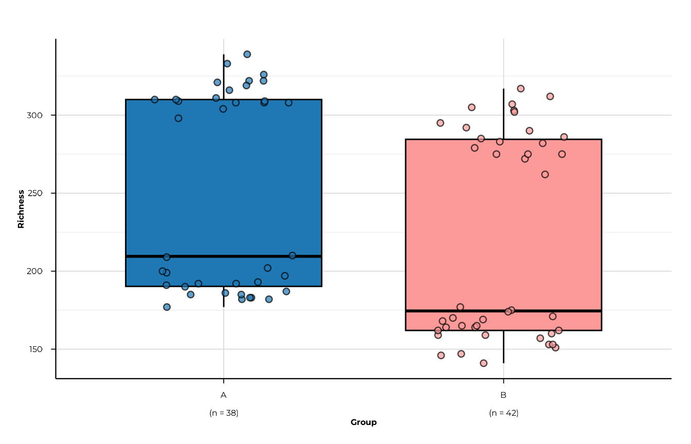

### All five metrics

``` r

for (m in c("richness", "shannon_diversity", "simpson_diversity",
            "pielou_evenness", "berger_parker_dominance")) {
  print(plot_alpha(alpha_group, metric = m, group_col = "group"))
}
#> [11:57:18] INFO  plotting alpha diversity (precomputed)
#>                  -> metric: richness
#> [11:57:18] OK    plotting alpha diversity (precomputed) - done
#>                  -> elapsed: 0.084s
```

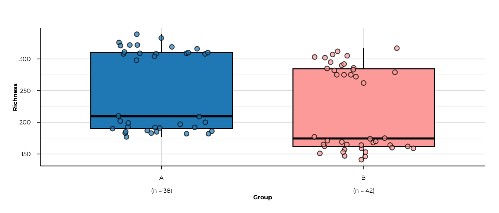

    #> [11:57:18] INFO  plotting alpha diversity (precomputed)
    #>                  -> metric: shannon_diversity
    #> [11:57:18] OK    plotting alpha diversity (precomputed) - done
    #>                  -> elapsed: 0.082s

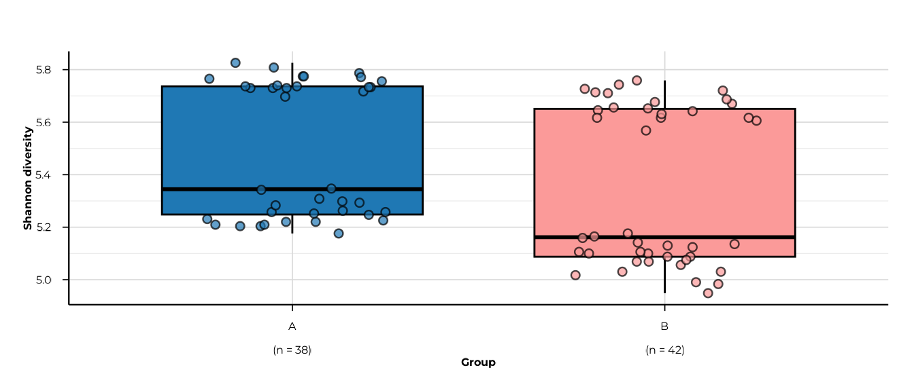

    #> [11:57:18] INFO  plotting alpha diversity (precomputed)
    #>                  -> metric: simpson_diversity
    #> [11:57:18] OK    plotting alpha diversity (precomputed) - done
    #>                  -> elapsed: 0.082s

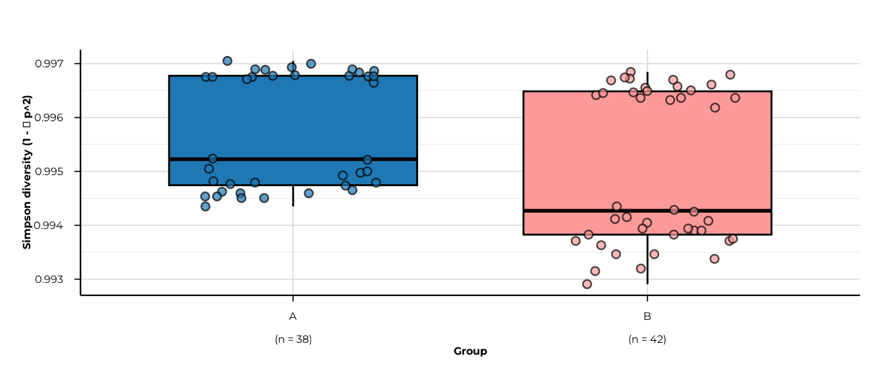

    #> [11:57:19] INFO  plotting alpha diversity (precomputed)
    #>                  -> metric: pielou_evenness
    #> [11:57:19] OK    plotting alpha diversity (precomputed) - done
    #>                  -> elapsed: 0.047s

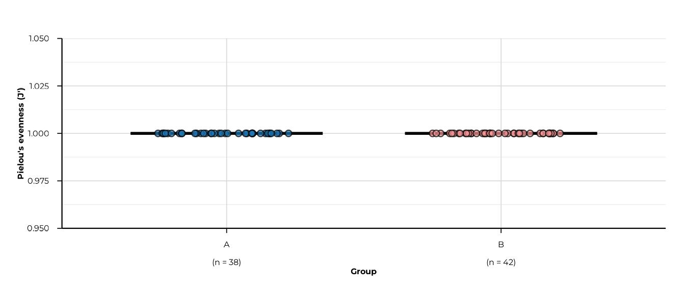

    #> [11:57:19] INFO  plotting alpha diversity (precomputed)
    #>                  -> metric: berger_parker_dominance
    #> [11:57:19] OK    plotting alpha diversity (precomputed) - done
    #>                  -> elapsed: 0.081s

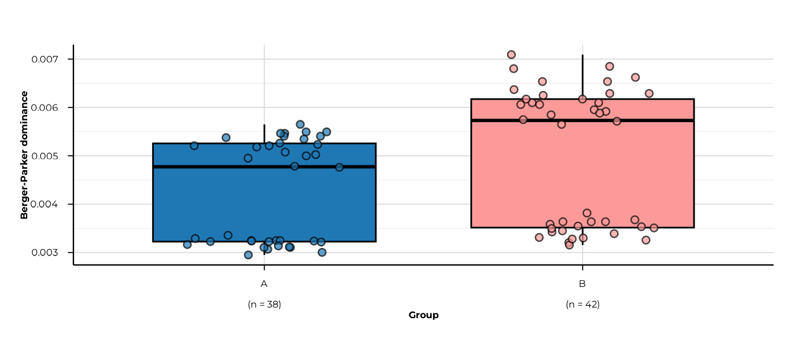

### Faceting across multiple ranks

When diversity was computed at multiple ranks, set
`facet_by_rank = TRUE` (the default) to get one panel per rank.

> **Note on this toy example.** The peptides shipped with
> [`load_example_data()`](https://polymerase3.github.io/phiper/reference/load_example_data.md)
> are synthetic identifiers that do not map to any entry in the peptide
> library. As a result, all taxonomic rank columns (`family`, `genus`,
> …) are empty for every peptide, so richness at those ranks is 0 for
> all samples. In a real PhIP-seq experiment where peptides carry proper
> library annotations, each rank would show non-zero diversity
> reflecting the taxonomic breadth of each patient’s reactivity.

``` r

plot_alpha(
  alpha_tax,
  metric        = "richness",
  group_col     = "group",
  facet_by_rank = TRUE,
  ncol          = 3
)
#> [11:57:19] INFO  plotting alpha diversity (precomputed)
#>                  -> metric: richness
#> [11:57:19] OK    plotting alpha diversity (precomputed) - done
#>                  -> elapsed: 0.05s
```

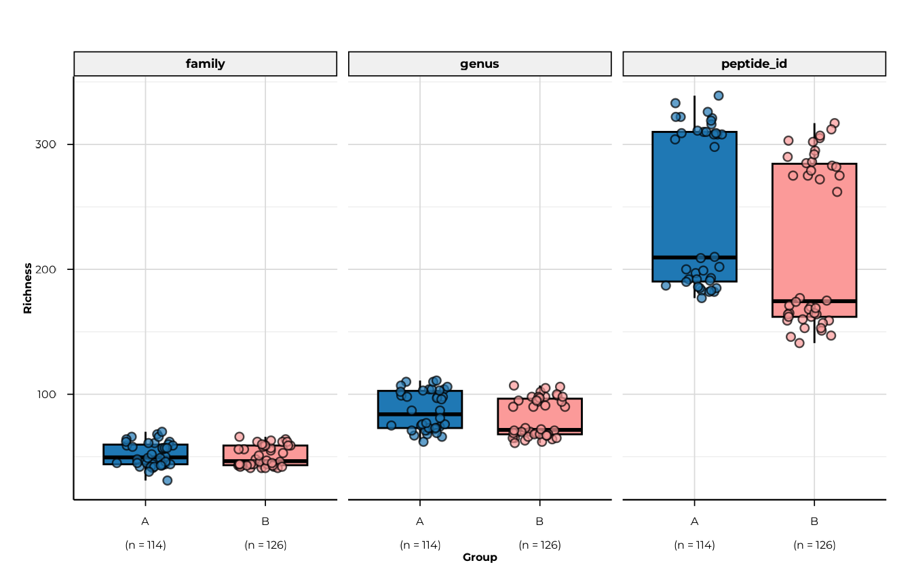

Disable faceting and restrict to a single rank with `filter_ranks`.

``` r

plot_alpha(
  alpha_tax,
  metric        = "richness",
  group_col     = "group",
  filter_ranks  = "peptide_id",
  facet_by_rank = FALSE
)
#> [11:57:20] INFO  plotting alpha diversity (precomputed)
#>                  -> metric: richness
#> [11:57:20] OK    plotting alpha diversity (precomputed) - done
#>                  -> elapsed: 0.085s
```


### Filtering and ordering groups

Use `filter_groups` to keep a subset and `x_order` to control axis
order.

``` r

plot_alpha(
  alpha_both$timepoint,
  metric        = "shannon_diversity",
  group_col     = "timepoint",
  filter_groups = c("T1", "T2"),
  x_order       = c("T1", "T2"),
  x_labels      = c(T1 = "Baseline", T2 = "Follow-up")
)
#> [11:57:20] INFO  plotting alpha diversity (precomputed)
#>                  -> metric: shannon_diversity
#> [11:57:20] OK    plotting alpha diversity (precomputed) - done
#>                  -> elapsed: 0.049s
```

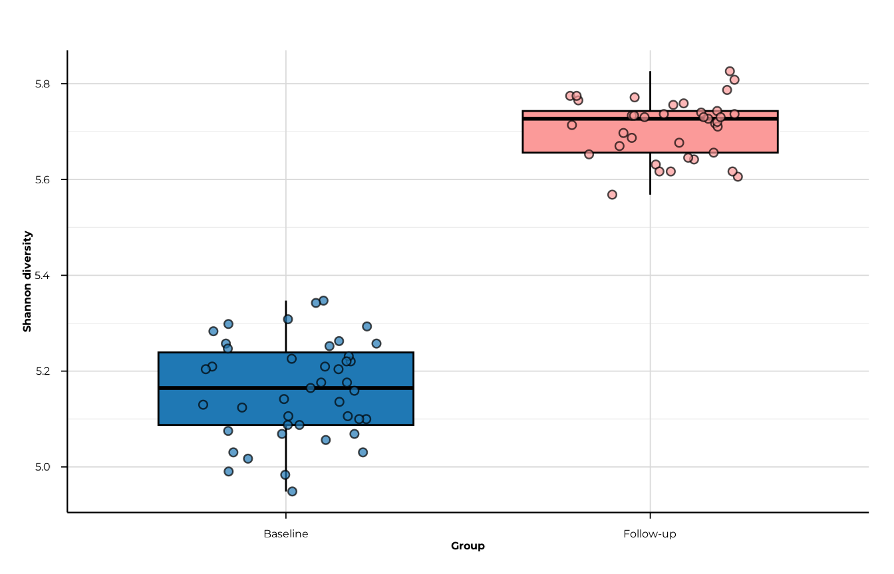

### Customising appearance

Simpson diversity values in this dataset are tightly clustered near 1
(range 0.993–0.997). Setting `y_range` to the actual data range rather
than the theoretical `c(0, 1)` reveals the within-group spread that
would otherwise be invisible.

``` r

plot_alpha(
  alpha_group,
  metric        = "simpson_diversity",
  group_col     = "group",
  custom_colors = c(A = "#E41A1C", B = "#377EB8"),
  y_range       = c(0.99, 1),
  x_tickangle   = 30,
  show_grids    = FALSE,
  point_size    = 2.5,
  point_alpha   = 0.6
)
#> [11:57:21] INFO  plotting alpha diversity (precomputed)
#>                  -> metric: simpson_diversity
#> [11:57:21] OK    plotting alpha diversity (precomputed) - done
#>                  -> elapsed: 0.083s
```

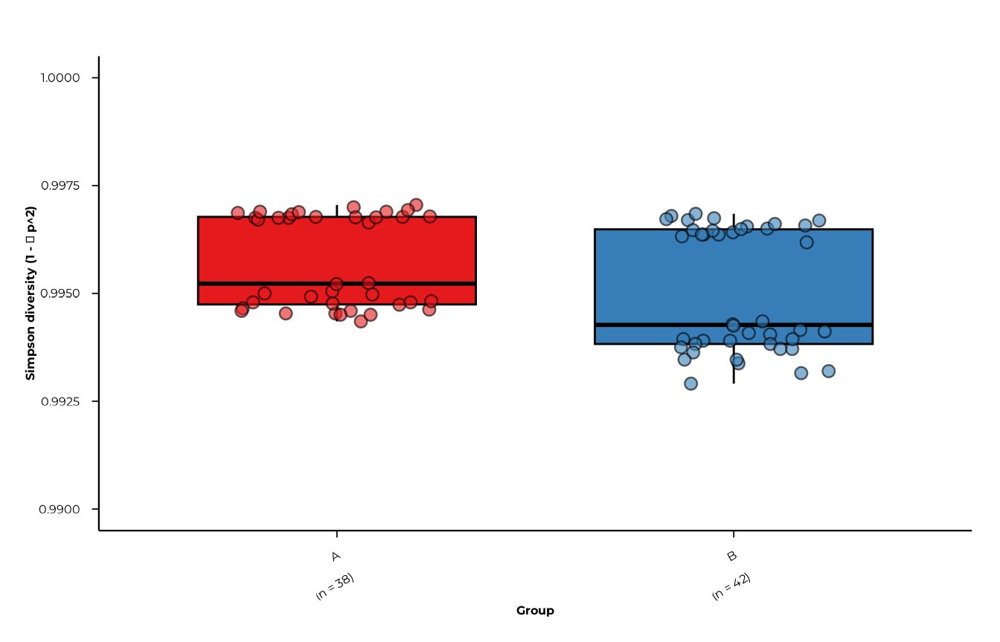

### Plotting the interaction table

When `group_interaction = TRUE`, the interaction element stores the
combined label in a column called `phip_interaction`.

``` r

plot_alpha(
  alpha_inter,
  metric           = "richness",
  group_col        = "phip_interaction",
  interaction_only = TRUE
)
#> [11:57:21] INFO  plotting alpha diversity (precomputed)
#>                  -> metric: richness
#> [11:57:21] INFO  selected interaction table
#>                    - group * timepoint
#> [11:57:21] OK    plotting alpha diversity (precomputed) - done
#>                  -> elapsed: 0.085s
```

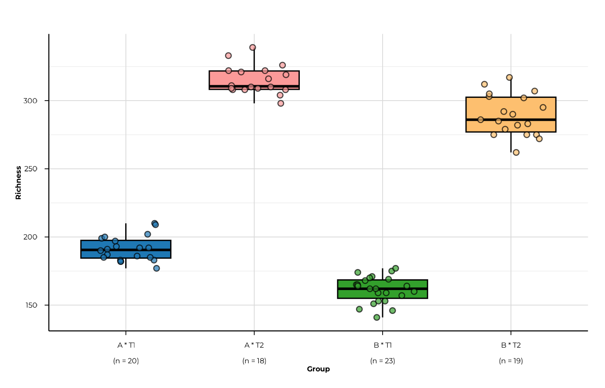

### `plot_alpha_interactive()` — plotly

The interactive version mirrors the static API and returns a plotly
widget, making it suitable for HTML reports and Shiny apps.

``` r

plot_alpha_interactive(
  alpha_group,
  metric    = "richness",
  group_col = "group"
)
```

All display parameters — `custom_colors`, `x_order`, `y_range`,
`filter_groups`, `facet_by_rank` — behave identically to the static
version.

------------------------------------------------------------------------

## Statistical testing

[`compute_alpha_significance()`](https://polymerase3.github.io/phiper/reference/compute_alpha_significance.md)
runs **global** and **pairwise** hypothesis tests on every
`(rank, metric)` combination in the alpha diversity result.

### Default: Kruskal-Wallis + Wilcoxon

``` r

sig <- compute_alpha_significance(
  alpha_group,
  group_col = "group"
)
sig
#> $global
#> # A tibble: 5 × 5
#>   rank       metric                  statistic  p_value test          
#>   <chr>      <chr>                       <dbl>    <dbl> <chr>         
#> 1 peptide_id richness                     14.2 0.000168 kruskal-wallis
#> 2 peptide_id shannon_diversity            14.2 0.000168 kruskal-wallis
#> 3 peptide_id simpson_diversity            14.2 0.000168 kruskal-wallis
#> 4 peptide_id pielou_evenness             Inf   0        kruskal-wallis
#> 5 peptide_id berger_parker_dominance      14.2 0.000168 kruskal-wallis
#> 
#> $pairwise
#> # A tibble: 5 × 9
#>   rank       metric           group1 group2   p_raw   p_adj cohens_d stars test 
#>   <chr>      <chr>            <chr>  <chr>    <dbl>   <dbl>    <dbl> <chr> <chr>
#> 1 peptide_id richness         A      B      1.71e-4 1.71e-4    0.475 ***   wilc…
#> 2 peptide_id shannon_diversi… A      B      1.71e-4 1.71e-4    0.511 ***   wilc…
#> 3 peptide_id simpson_diversi… A      B      1.71e-4 1.71e-4    0.563 ***   wilc…
#> 4 peptide_id pielou_evenness  A      B      3.05e-2 3.05e-2    0     *     wilc…
#> 5 peptide_id berger_parker_d… A      B      1.71e-4 1.71e-4   -0.563 ***   wilc…
#> 
#> attr(,"class")
#> [1] "phip_alpha_significance"
#> attr(,"group_col")
#> [1] "group"
#> attr(,"global_test")
#> [1] "kruskal"
#> attr(,"pairwise_test")
#> [1] "wilcoxon"
#> attr(,"p_adjust_method")
#> [1] "BH"
#> attr(,"metrics")
#> [1] "richness"                "shannon_diversity"      
#> [3] "simpson_diversity"       "pielou_evenness"        
#> [5] "berger_parker_dominance"
#> attr(,"ranks")
#> [1] "peptide_id"
```

The return value is a list of class `"phip_alpha_significance"` with two
tibbles.

#### Global test

One row per `(rank, metric)`:

``` r

sig$global
#> # A tibble: 5 × 5
#>   rank       metric                  statistic  p_value test          
#>   <chr>      <chr>                       <dbl>    <dbl> <chr>         
#> 1 peptide_id richness                     14.2 0.000168 kruskal-wallis
#> 2 peptide_id shannon_diversity            14.2 0.000168 kruskal-wallis
#> 3 peptide_id simpson_diversity            14.2 0.000168 kruskal-wallis
#> 4 peptide_id pielou_evenness             Inf   0        kruskal-wallis
#> 5 peptide_id berger_parker_dominance      14.2 0.000168 kruskal-wallis
```

#### Pairwise comparisons

One row per `(rank, metric, pair)` with raw and adjusted p-values,
Cohen’s d, and significance stars:

``` r

sig$pairwise
#> # A tibble: 5 × 9
#>   rank       metric           group1 group2   p_raw   p_adj cohens_d stars test 
#>   <chr>      <chr>            <chr>  <chr>    <dbl>   <dbl>    <dbl> <chr> <chr>
#> 1 peptide_id richness         A      B      1.71e-4 1.71e-4    0.475 ***   wilc…
#> 2 peptide_id shannon_diversi… A      B      1.71e-4 1.71e-4    0.511 ***   wilc…
#> 3 peptide_id simpson_diversi… A      B      1.71e-4 1.71e-4    0.563 ***   wilc…
#> 4 peptide_id pielou_evenness  A      B      3.05e-2 3.05e-2    0     *     wilc…
#> 5 peptide_id berger_parker_d… A      B      1.71e-4 1.71e-4   -0.563 ***   wilc…
```

### Choosing the test

``` r

sig_anova <- compute_alpha_significance(
  alpha_group,
  group_col     = "group",
  global_test   = "anova",
  pairwise_test = "tukey"
)
sig_anova$global
#> # A tibble: 5 × 5
#>   rank       metric                  statistic p_value test 
#>   <chr>      <chr>                       <dbl>   <dbl> <chr>
#> 1 peptide_id richness                     4.50  0.0370 anova
#> 2 peptide_id shannon_diversity            5.21  0.0252 anova
#> 3 peptide_id simpson_diversity            6.32  0.0140 anova
#> 4 peptide_id pielou_evenness              3.48  0.0657 anova
#> 5 peptide_id berger_parker_dominance      6.32  0.0140 anova
```

### p-value adjustment

Any method accepted by
[`p.adjust()`](https://rdrr.io/r/stats/p.adjust.html) is supported:

``` r

sig_bonf <- compute_alpha_significance(
  alpha_group,
  group_col       = "group",
  p_adjust_method = "bonferroni"
)
sig_bonf$pairwise[, c("metric", "group1", "group2", "p_raw", "p_adj", "stars")]
#> # A tibble: 5 × 6
#>   metric                  group1 group2    p_raw    p_adj stars
#>   <chr>                   <chr>  <chr>     <dbl>    <dbl> <chr>
#> 1 richness                A      B      0.000171 0.000171 ***  
#> 2 shannon_diversity       A      B      0.000171 0.000171 ***  
#> 3 simpson_diversity       A      B      0.000171 0.000171 ***  
#> 4 pielou_evenness         A      B      0.0305   0.0305   *    
#> 5 berger_parker_dominance A      B      0.000171 0.000171 ***
```

### Restricting to a subset of metrics

``` r

sig_rich <- compute_alpha_significance(
  alpha_group,
  group_col = "group",
  metric    = c("richness", "shannon_diversity")
)
sig_rich$global
#> # A tibble: 2 × 5
#>   rank       metric            statistic  p_value test          
#>   <chr>      <chr>                 <dbl>    <dbl> <chr>         
#> 1 peptide_id richness               14.2 0.000168 kruskal-wallis
#> 2 peptide_id shannon_diversity      14.2 0.000168 kruskal-wallis
```

### Multi-rank significance

When alpha was computed at multiple ranks, significance is tested at
every rank automatically:

``` r

sig_tax <- compute_alpha_significance(
  alpha_tax,
  group_col = "group",
  metric    = "richness"
)
dplyr::select(sig_tax$global, rank, metric, statistic, p_value)
#> # A tibble: 3 × 4
#>   rank       metric   statistic  p_value
#>   <chr>      <chr>        <dbl>    <dbl>
#> 1 peptide_id richness    14.2   0.000168
#> 2 family     richness     0.666 0.414   
#> 3 genus      richness     5.58  0.0182
```

------------------------------------------------------------------------

## Visualising significance

[`plot_alpha_significance()`](https://polymerase3.github.io/phiper/reference/plot_alpha_significance.md)
offers two display modes.

### Table mode

Returns the filtered pairwise tibble — useful for including in reports
or further processing:

``` r

plot_alpha_significance(
  sig,
  metric      = "richness",
  type        = "table",
  p_threshold = 0.05
)
#> # A tibble: 1 × 9
#>   rank       metric   group1 group2    p_raw    p_adj cohens_d stars test    
#>   <chr>      <chr>    <chr>  <chr>     <dbl>    <dbl>    <dbl> <chr> <chr>   
#> 1 peptide_id richness A      B      0.000171 0.000171    0.475 ***   wilcoxon
```

Set `p_threshold = 1` to retrieve all pairs regardless of significance.

``` r

plot_alpha_significance(
  sig,
  metric      = "richness",
  type        = "table",
  p_threshold = 1
)
#> # A tibble: 1 × 9
#>   rank       metric   group1 group2    p_raw    p_adj cohens_d stars test    
#>   <chr>      <chr>    <chr>  <chr>     <dbl>    <dbl>    <dbl> <chr> <chr>   
#> 1 peptide_id richness A      B      0.000171 0.000171    0.475 ***   wilcoxon
```

### Heatmap mode

Produces a Cohen’s d heatmap with significance stars overlaid.
Non-significant pairs (p_adj \> threshold) are shown in grey.

``` r

plot_alpha_significance(
  sig,
  metric      = "richness",
  type        = "heatmap",
  p_threshold = 1     # show all pairs; colour by effect size
)
```

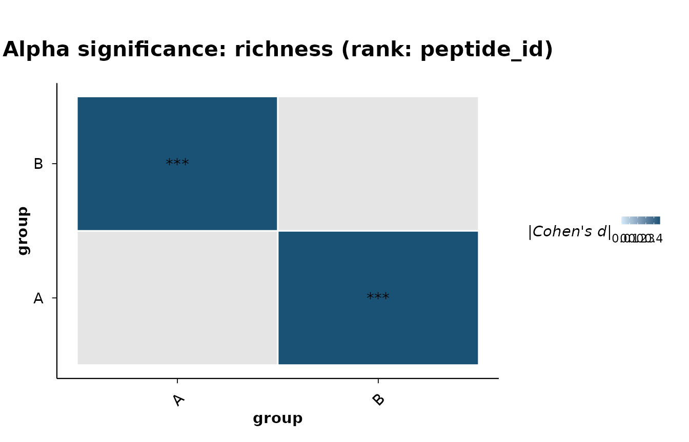

### Heatmap across metrics

Loop over metrics to produce one heatmap per metric:

``` r

for (m in attr(sig, "metrics")) {
  print(
    plot_alpha_significance(sig, metric = m, type = "heatmap", p_threshold = 1)
  )
}
```

------------------------------------------------------------------------

## Significance brackets on boxplots

Pass a `"phip_alpha_significance"` object to
[`plot_alpha()`](https://polymerase3.github.io/phiper/reference/plot_alpha.md)
via the `significance` argument, and set `show_significance = TRUE` to
overlay pairwise brackets automatically. The `ggsignif` package must be
installed.

``` r

plot_alpha(
  alpha_group,
  metric            = "richness",
  group_col         = "group",
  significance      = sig,
  show_significance = TRUE,
  sig_p_threshold   = 0.05
)
#> [11:57:22] INFO  plotting alpha diversity (precomputed)
#>                  -> metric: richness
#> [11:57:22] OK    plotting alpha diversity (precomputed) - done
#>                  -> elapsed: 0.062s
```

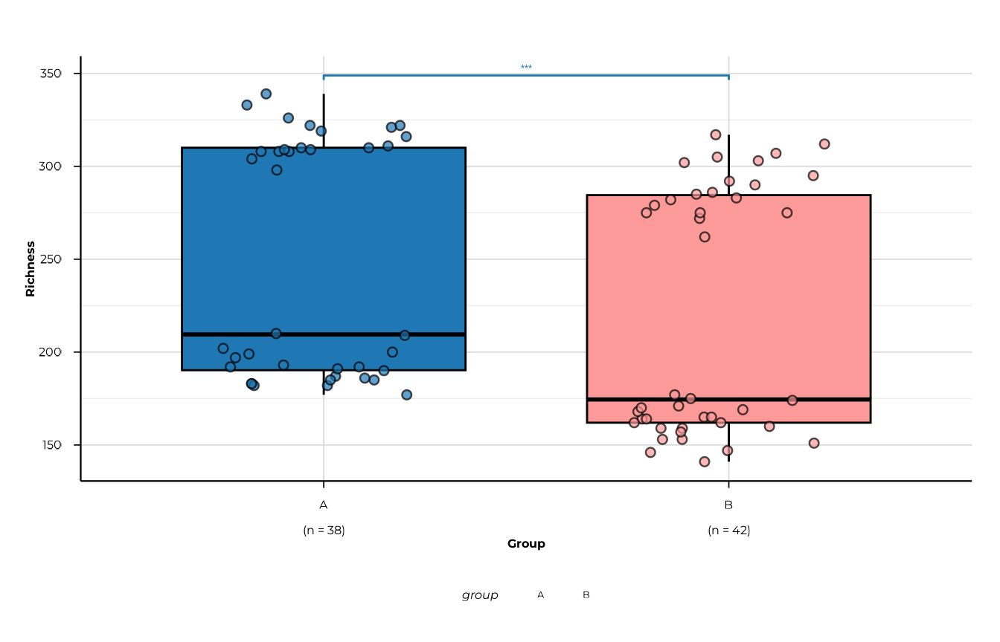

Tune the bracket geometry with `sig_step_increase` and `sig_tip_length`:

``` r

plot_alpha(
  alpha_group,
  metric            = "shannon_diversity",
  group_col         = "group",
  significance      = sig,
  show_significance = TRUE,
  sig_p_threshold   = 0.1,
  sig_step_increase = 0.08,
  sig_tip_length    = 0.005
)
#> [11:57:23] INFO  plotting alpha diversity (precomputed)
#>                  -> metric: shannon_diversity
#> [11:57:23] OK    plotting alpha diversity (precomputed) - done
#>                  -> elapsed: 0.093s
```

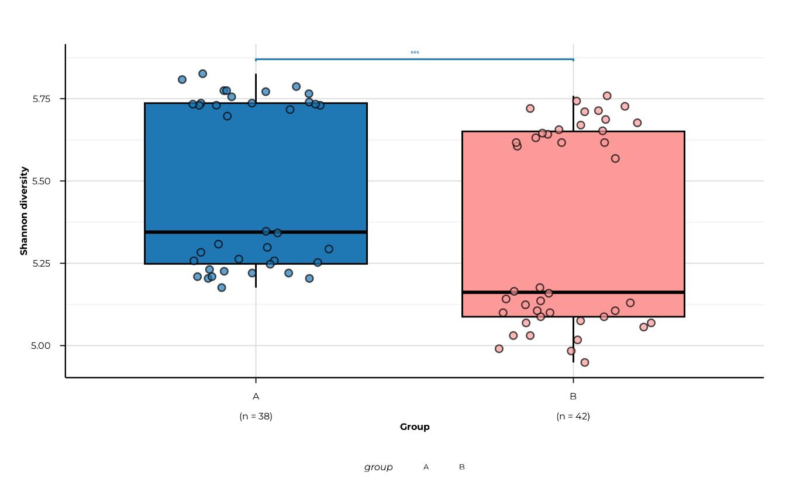

------------------------------------------------------------------------

## Putting it all together

A typical analysis runs in four steps:

``` r

# 1. Compute diversity at peptide and family level
alpha <- compute_alpha(
  pd,
  group_cols        = c("group", "timepoint"),
  ranks             = c("peptide_id", "family"),
  group_interaction = TRUE
)

# 2. Visualise
plot_alpha(alpha, metric = "richness",    group_col = "group")
plot_alpha(alpha, metric = "pielou_evenness", group_col = "timepoint",
                     x_order = c("T1", "T2"),
                     x_labels = c(T1 = "Baseline", T2 = "Follow-up"))

# 3. Test
sig <- compute_alpha_significance(alpha, group_col = "group")

# 4. Report
sig$global
plot_alpha_significance(sig, type = "heatmap", p_threshold = 1)
plot_alpha(alpha, metric = "richness", group_col = "group",
                     significance = sig, show_significance = TRUE)
```

------------------------------------------------------------------------

## Session info

``` r

sessionInfo()
#> R version 4.6.1 (2026-06-24)
#> Platform: x86_64-pc-linux-gnu
#> Running under: Ubuntu 24.04.4 LTS
#> 
#> Matrix products: default
#> BLAS:   /usr/lib/x86_64-linux-gnu/openblas-pthread/libblas.so.3 
#> LAPACK: /usr/lib/x86_64-linux-gnu/openblas-pthread/libopenblasp-r0.3.26.so;  LAPACK version 3.12.0
#> 
#> locale:
#>  [1] LC_CTYPE=C.UTF-8       LC_NUMERIC=C           LC_TIME=C.UTF-8       
#>  [4] LC_COLLATE=C.UTF-8     LC_MONETARY=C.UTF-8    LC_MESSAGES=C.UTF-8   
#>  [7] LC_PAPER=C.UTF-8       LC_NAME=C              LC_ADDRESS=C          
#> [10] LC_TELEPHONE=C         LC_MEASUREMENT=C.UTF-8 LC_IDENTIFICATION=C   
#> 
#> time zone: UTC
#> tzcode source: system (glibc)
#> 
#> attached base packages:
#> [1] stats     graphics  grDevices utils     datasets  methods   base     
#> 
#> other attached packages:
#> [1] phiper_0.4.5
#> 
#> loaded via a namespace (and not attached):
#>  [1] tidyr_1.3.2        utf8_1.2.6         sass_0.4.10        generics_0.1.4    
#>  [5] digest_0.6.39      magrittr_2.0.5     evaluate_1.0.5     grid_4.6.1        
#>  [9] RColorBrewer_1.1-3 sysfonts_0.8.9     showtextdb_3.0     blob_1.3.0        
#> [13] fastmap_1.2.0      jsonlite_2.0.0     DBI_1.3.0          purrr_1.2.2       
#> [17] scales_1.4.0       textshaping_1.0.5  jquerylib_0.1.4    duckdb_1.5.5      
#> [21] cli_3.6.6          rlang_1.3.0        chk_0.11.0         dbplyr_2.6.0      
#> [25] phiperio_0.5.5     withr_3.0.3        cachem_1.1.0       yaml_2.3.12       
#> [29] otel_0.2.0         tools_4.6.1        ggsignif_0.6.4     dplyr_1.2.1       
#> [33] ggplot2_4.0.3      showtext_0.9-8     vctrs_0.7.3        R6_2.6.1          
#> [37] lifecycle_1.0.5    fs_2.1.0           htmlwidgets_1.6.4  ragg_1.5.2        
#> [41] pkgconfig_2.0.3    desc_1.4.3         pkgdown_2.2.1      RcppParallel_6.2.1
#> [45] pillar_1.11.1      bslib_0.12.0       gtable_0.3.6       glue_1.8.1        
#> [49] Rcpp_1.1.2         systemfonts_1.3.2  xfun_0.60          tibble_3.3.1      
#> [53] tidyselect_1.2.1   knitr_1.52         farver_2.1.2       htmltools_0.5.9   
#> [57] labeling_0.4.3     rmarkdown_2.32     compiler_4.6.1     S7_0.2.2
```
