# Beta Diversity Analysis in PhIP-seq

## Overview

Beta diversity quantifies **between-sample** dissimilarity of antibody
reactivity profiles. In PhIP-seq, each sample is represented by a vector
of peptide presence/absence calls or continuous enrichment scores.
Comparing these vectors reveals how similar or different individual
immune repertoires are — and whether those differences are explained by
group membership, disease status, or timepoint.

This vignette walks through the complete beta diversity workflow in
**phiper**:

1.  Computing pairwise distances with
    [`compute_distance()`](https://polymerase3.github.io/phiper/reference/compute_distance.md)
2.  Unconstrained ordination (PCoA) with
    [`compute_pcoa()`](https://polymerase3.github.io/phiper/reference/compute_pcoa.md),
    [`plot_pcoa()`](https://polymerase3.github.io/phiper/reference/plot_pcoa.md),
    and
    [`plot_scree()`](https://polymerase3.github.io/phiper/reference/plot_scree.md)
3.  Feature–axis associations with
    [`compute_pcoa_feature_associations()`](https://polymerase3.github.io/phiper/reference/compute_pcoa_feature_associations.md)
4.  Constrained ordination (CAP / db-RDA) with
    [`compute_capscale()`](https://polymerase3.github.io/phiper/reference/compute_capscale.md)
    and
    [`plot_cap()`](https://polymerase3.github.io/phiper/reference/plot_cap.md)
5.  Permutation-based testing (PERMANOVA) with
    [`compute_permanova()`](https://polymerase3.github.io/phiper/reference/compute_permanova.md)
6.  Homogeneity of dispersion with
    [`compute_dispersion()`](https://polymerase3.github.io/phiper/reference/compute_dispersion.md)
    and
    [`plot_dispersion()`](https://polymerase3.github.io/phiper/reference/plot_dispersion.md)
7.  Non-linear embedding (t-SNE) with
    [`compute_tsne()`](https://polymerase3.github.io/phiper/reference/compute_tsne.md)
    and
    [`plot_tsne()`](https://polymerase3.github.io/phiper/reference/plot_tsne.md)

------------------------------------------------------------------------

## Setup

``` r

library(phiper)
library(dplyr)
```

Load the bundled example dataset. It contains two patient groups (`A`,
`B`) measured at two timepoints (`T1`, `T2`) across 1 000 simulated
peptides.

``` r

pd <- load_example_data()
#> [12:08:00] INFO  Constructing <phip_data> object
#>                  -> create_data()
#> [12:08:00] INFO  Fetching peptide metadata library via get_peptide_library()
#> [12:08:00] INFO  Retrieving peptide metadata into DuckDB cache
#>                  -> get_peptide_library(force_refresh = FALSE)
#> [12:08:00] INFO  Opened DuckDB connection
#>                    - cache dir:
#>                      /home/runner/.cache/R/phiperio/peptide_meta/phip_cache.duckdb
#>                    - table: peptide_meta
#> [12:08:00] OK    Using cached download (SHA-256 match)
#> [12:08:03] OK    Download complete and loaded into R
#> [12:08:08] INFO  Importing sanitized metadata into DuckDB cache...
#> [12:08:10] OK    peptide_meta table created in DuckDB cache
#> [12:08:10] OK    Retrieving peptide metadata into DuckDB cache - done
#>                  -> elapsed: 9.843s
#> [12:08:10] OK    Peptide metadata acquired
#> [12:08:10] INFO  Validating <phip_data>
#>                  -> validate_phip_data()
#> [12:08:10] INFO  Checking structural requirements (shape & mandatory columns)
#> [12:08:10] INFO  Checking outcome family availability (exist / fold_change /
#>                  raw_counts)
#> [12:08:10] INFO  Checking collisions with reserved names
#>                    - subject_id, sample_id, timepoint, peptide_id, exist,
#>                      fold_change, counts_input, counts_hit
#> [12:08:10] INFO  Ensuring all columns are atomic (no list-cols)
#> [12:08:10] INFO  Checking key uniqueness
#> [12:08:10] INFO  Validating value ranges & types for outcomes
#> [12:08:10] INFO  Assessing sparsity (NA/zero prevalence vs threshold)
#>                    - warn threshold: 50%
#> [12:08:10] INFO  Checking peptide_id coverage against peptide_library
#> [12:08:10] INFO  Checking full grid completeness (peptide * sample)
#> [12:08:10] INFO  Counts table is not a full peptide * sample grid
#>                    - observed rows: 78200
#>                    - expected rows: 156000
#> [12:08:10] OK    Validating <phip_data> - done
#>                  -> elapsed: 0.5s
#> [12:08:10] OK    Constructing <phip_data> object - done
#>                  -> elapsed: 10.346s
pd
#> ── <phip_data> ───────────────────────────────────────────────────────────────── 
#> 
#> counts (first 5 rows): 
#> # A tibble: 5 × 9
#>   sample_id subject_id group timepoint peptide_id     exist counts_control
#>   <chr>     <chr>      <chr> <chr>     <chr>          <int>          <int>
#> 1 B_T1_1    1          B     T1        agilent_100642     0             16
#> 2 B_T1_1    1          B     T1        agilent_100997     1             18
#> 3 B_T1_1    1          B     T1        agilent_10133      0             15
#> 4 B_T1_1    1          B     T1        agilent_101516     0             29
#> 5 B_T1_1    1          B     T1        agilent_101615     0             16
#> # ℹ 2 more variables: counts_hits <int>, fold_change <dbl>
#> 
#> table size: 78,200 rows x 9 columns
#> 
#> peptide library preview (first 5 rows): 
#> # A tibble: 5 × 8
#>   peptide_id    Fullname                 species genus family order class common
#>   <chr>         <chr>                    <chr>   <chr> <chr>  <chr> <chr> <chr> 
#> 1 agilent_1     Chromodomain-helicase-D… Homo s… Homo  Homin… Prim… Mamm… Human 
#> 2 agilent_10    Lipase 2 precursor (Gly… Staphy… Stap… Staph… Baci… Baci… NA    
#> 3 agilent_100   cell surface protein pr… Porphy… Porp… Porph… Bact… Bact… NA    
#> 4 agilent_1000  Coagulation factor VIII… Homo s… Homo  Homin… Prim… Mamm… Human 
#> 5 agilent_10000 transmembrane serine/th… Mycoba… Myco… Mycob… Myco… Acti… NA    
#> ... plus 37 more columns
#> 
#> library size: 357,190 rows x 45 columns
#> 
#> meta flags: 
#>   con:            <duckdb_connection>
#>   longitudinal:   TRUE
#>   exist:          TRUE
#>   fold_change:    TRUE
#>   raw_counts:     FALSE
#>   extra_cols:     group, counts_control, counts_hits
#>   peptide_con:    <duckdb_connection>
#>   materialise_table: TRUE
#>   finalizer_env:  <environment>
#>   full_cross:     FALSE
```

> **Note.** The example data are entirely simulated and have no
> biological meaning. They exist solely to demonstrate the API.

Extract a one-row-per-sample metadata table — you will need it to
annotate ordination plots later:

``` r

meta <- pd$data_long |>
  select(sample_id, subject_id, group, timepoint) |>
  distinct() |>
  collect()

glimpse(meta)
#> Rows: 80
#> Columns: 4
#> $ sample_id  <chr> "A_T2_10", "B_T2_11", "A_T1_12", "A_T2_12", "B_T1_18", "B_T…
#> $ subject_id <chr> "10", "11", "12", "12", "18", "3", "3", "4", "4", "1", "13"…
#> $ group      <chr> "A", "B", "A", "A", "B", "B", "A", "B", "A", "A", "A", "A",…
#> $ timepoint  <chr> "T2", "T2", "T1", "T2", "T1", "T1", "T2", "T1", "T1", "T1",…
```

------------------------------------------------------------------------

## Step 1 — Distance matrix

[`compute_distance()`](https://polymerase3.github.io/phiper/reference/compute_distance.md)
builds a sample × feature abundance matrix from a `phip_data` object and
computes pairwise distances between samples. The normalised abundance
matrix is attached to the returned `dist` object as the `"abundances"`
attribute — this is reused downstream by
[`compute_pcoa_feature_associations()`](https://polymerase3.github.io/phiper/reference/compute_pcoa_feature_associations.md)
and
[`compute_capscale()`](https://polymerase3.github.io/phiper/reference/compute_capscale.md).

### Choosing a distance and normalisation

The right combination depends on the type of data you want to compare:

| Scenario                | `value_col`     | `method_normalization` | `distance`  |
|-------------------------|-----------------|------------------------|-------------|
| Binary presence/absence | `"exist"`       | `"auto"` (→ `"none"`)  | `"jaccard"` |
| Continuous enrichment   | `"fold_change"` | `"hellinger"`          | `"bray"`    |
| Raw counts              | `"counts_hits"` | `"relative"`           | `"bray"`    |

We use fold-change data with Hellinger normalisation and Bray-Curtis
dissimilarity throughout this vignette.

``` r

d <- compute_distance(
  pd,
  value_col            = "fold_change",
  method_normalization = "hellinger",
  distance             = "bray"
)
#> [12:08:10] INFO  building abundance matrix from `ps` using `fold_change`.
#> [12:08:10] INFO  building pivot spec (sample_id x peptide_id).
#> [12:08:11] INFO  Collecting long table (sample_id, peptide_id, value).
#>                  -> compute_distance
#> [12:08:11] INFO  Pivoting to wide abundance matrix in R.
#>                  -> compute_distance
#> [12:08:11] INFO  abundance matrix has 80 samples and 1950 features after
#>                  preprocessing.
#> [12:08:11] INFO  computing distance: bray
#> [12:08:11] INFO  distance matrix computation complete.

class(d)                       # a standard dist object
#> [1] "dist"
attr(d, "Size")                # number of samples
#> [1] 80
dim(attr(d, "abundances"))     # rows = samples, cols = features
#> [1]   80 1950
```

Parallelised computation via the optional `parallelDist` package is
requested with `n_threads`:

``` r

d <- compute_distance(
  pd,
  value_col            = "fold_change",
  method_normalization = "hellinger",
  distance             = "bray",
  n_threads            = 4L
)
```

------------------------------------------------------------------------

## Step 2 — Unconstrained ordination (PCoA)

### Computing PCoA

[`compute_pcoa()`](https://polymerase3.github.io/phiper/reference/compute_pcoa.md)
wraps [`stats::cmdscale()`](https://rdrr.io/r/stats/cmdscale.html) and
returns an S3 object of class `"beta_pcoa"` containing sample
coordinates, eigenvalues, variance explained, and eigenvalue
diagnostics.

``` r

pcoa_res <- compute_pcoa(d, neg_correction = "none", n_axes = 5L)
#> [12:08:11] INFO  performing principal coordinates analysis
#> [12:08:11] INFO  extracting sample coordinates.
#> [12:08:11] INFO  summarizing eigenvalues and variance explained.
#> [12:08:11] INFO  pcoa analysis complete.

names(pcoa_res)           # components of the result
#> [1] "sample_coords"     "eigenvalues"       "var_explained"    
#> [4] "eigen_diagnostics" "correction_infos"
pcoa_res$var_explained    # % variance per axis
#> # A tibble: 1 × 6
#>   `%PCoA1` `%PCoA2` `%PCoA3` `%PCoA4` `%PCoA5` `%Other`
#>      <dbl>    <dbl>    <dbl>    <dbl>    <dbl>    <dbl>
#> 1     76.4    0.568    0.449    0.431    0.426     21.7
pcoa_res$eigen_diagnostics
#> # A tibble: 1 × 6
#>   sum_negative sum_positive ratio_negative_positive min_eigenvalue n_negative
#>          <dbl>        <dbl>                   <dbl>          <dbl>      <int>
#> 1            0         22.4                       0       1.56e-16          0
#> # ℹ 1 more variable: frac_negative <dbl>
```

The `eigen_diagnostics` tibble reports how many eigenvalues are negative
and how large they are relative to the positive ones. Non-Euclidean
distances (such as Bray-Curtis) routinely produce a small fraction of
negative eigenvalues; a ratio below ~0.1 is generally acceptable. When
negative eigenvalues are substantial, apply a Lingoes or Cailliez
correction:

``` r

pcoa_corr <- compute_pcoa(d, neg_correction = "lingoes", n_axes = 5L)
pcoa_corr$correction_infos
```

### Scree plot

[`plot_scree()`](https://polymerase3.github.io/phiper/reference/plot_scree.md)
visualises how variance is distributed across axes. It helps decide how
many axes are worth inspecting.

``` r

plot_scree(pcoa_res, n_axes = 5L, type = "bar")
```

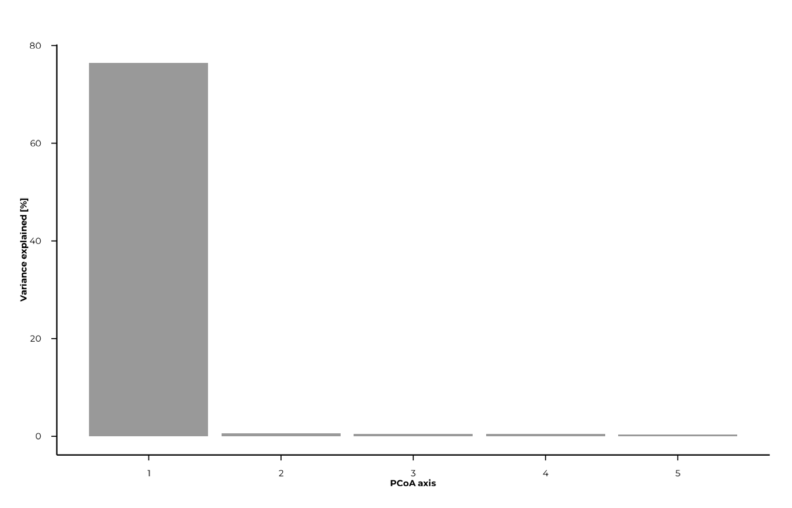

``` r

plot_scree(pcoa_res, n_axes = 5L, type = "line")
```


### Feature associations

[`compute_pcoa_feature_associations()`](https://polymerase3.github.io/phiper/reference/compute_pcoa_feature_associations.md)
computes associations between individual features (peptides) and PCoA
axes. It needs both the `dist` object (to access the `"abundances"`
attribute) and the `pcoa_res` object. Call it **before** joining any
metadata into `pcoa_res$sample_coords`, as the function expects only
numeric coordinate columns.

``` r

feat_assoc <- compute_pcoa_feature_associations(
  dist_obj           = d,
  pcoa_result        = pcoa_res,
  top_features       = 20L,
  association_method = "correlation"
)

feat_assoc
#> # A tibble: 98 × 6
#>    feature         PCoA1     PCoA2    PCoA3    PCoA4   PCoA5
#>    <chr>           <dbl>     <dbl>    <dbl>    <dbl>   <dbl>
#>  1 agilent_104965  0.575 -0.166     0.0563   0.00412 -0.364 
#>  2 agilent_10520   0.665 -0.0385    0.0844  -0.0901  -0.318 
#>  3 agilent_106897 -0.641 -0.0424    0.340    0.0646   0.0485
#>  4 agilent_108992 -0.574 -0.0405    0.318    0.0751   0.0234
#>  5 agilent_112642  0.659 -0.101     0.0261   0.0492  -0.348 
#>  6 agilent_112881 -0.890  0.000964  0.0303   0.0307  -0.0148
#>  7 agilent_113090  0.665 -0.0726    0.0605  -0.310   -0.0235
#>  8 agilent_113632 -0.580 -0.349     0.0697  -0.0848   0.0485
#>  9 agilent_122851 -0.417 -0.386     0.103    0.114   -0.102 
#> 10 agilent_12596   0.581  0.123    -0.00273 -0.0334   0.339 
#> # ℹ 88 more rows
```

Three association methods are available:

| Method | Description |
|----|----|
| `"weighted_average"` | Abundance-weighted centroid of sample scores |
| `"correlation"` | Pearson correlation between feature abundance and axis score |
| `"regression"` | Regression slope of axis scores on feature abundance |

### Plotting PCoA

[`plot_pcoa()`](https://polymerase3.github.io/phiper/reference/plot_pcoa.md)
requires group and/or time columns to already be present in
`pcoa_res$sample_coords`. Join the metadata table before plotting:

``` r

pcoa_res$sample_coords <- left_join(
  pcoa_res$sample_coords,
  meta,
  by = "sample_id"
)
```

#### Basic plot — colour by group

``` r

plot_pcoa(
  pcoa_res,
  group_col = "group"
)
#> [12:08:12] INFO  Plotting PCoA: n=80 | group_col=group | time_col=<none> |
#>                  centroid_by=group
#>                  -> plot_pcoa
```

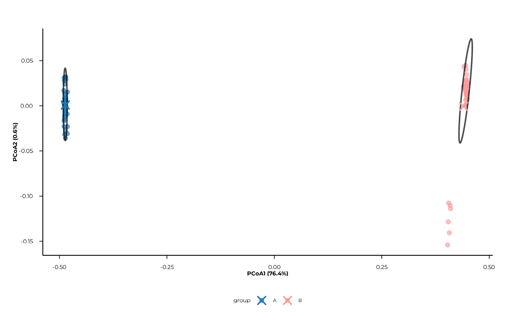

#### Adding a time factor

When `time_col` is supplied, points are **shaped** by time in addition
to being coloured by group.

``` r

plot_pcoa(
  pcoa_res,
  group_col = "group",
  time_col  = "timepoint"
)
#> [12:08:12] INFO  Plotting PCoA: n=80 | group_col=group | time_col=timepoint |
#>                  centroid_by=group_time
#>                  -> plot_pcoa
```


#### Centroids and centroid trajectories

`show_centroids = TRUE` (the default) overlays centroid points for each
group × time combination. Set `connect_centroids = "group"` to draw
paths that connect centroids along time within each group — useful for
tracking longitudinal change.

``` r

plot_pcoa(
  pcoa_res,
  group_col         = "group",
  time_col          = "timepoint",
  centroid_by       = "group_time",
  connect_centroids = "group"
)
#> [12:08:13] INFO  Plotting PCoA: n=80 | group_col=group | time_col=timepoint |
#>                  centroid_by=group_time
#>                  -> plot_pcoa
```

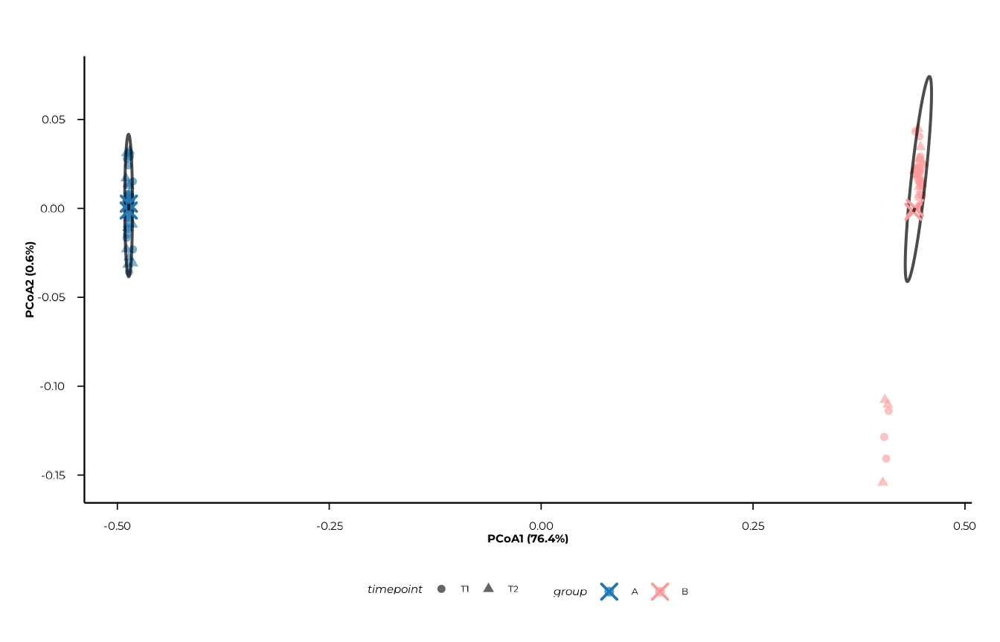

#### Confidence ellipses

`ellipse_by` accepts a character vector, so multiple ellipse types can
be overlaid simultaneously. Possible values are `"group"`, `"time"`, and
`"group_time"`.

``` r

plot_pcoa(
  pcoa_res,
  group_col      = "group",
  time_col       = "timepoint",
  show_centroids = FALSE,
  ellipse_by     = c("group", "group_time")
)
#> [12:08:14] INFO  Plotting PCoA: n=80 | group_col=group | time_col=timepoint |
#>                  centroid_by=group_time
#>                  -> plot_pcoa
```

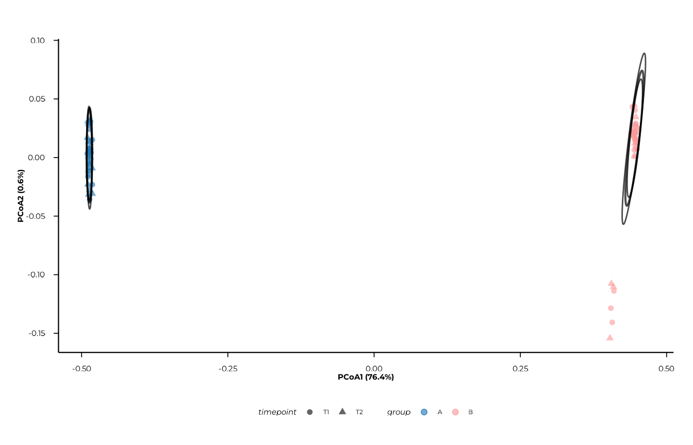

#### Plotting alternative axes

``` r

plot_pcoa(
  pcoa_res,
  axes      = c(2, 3),
  group_col = "group"
)
#> [12:08:14] INFO  Plotting PCoA: n=80 | group_col=group | time_col=<none> |
#>                  centroid_by=group
#>                  -> plot_pcoa
```

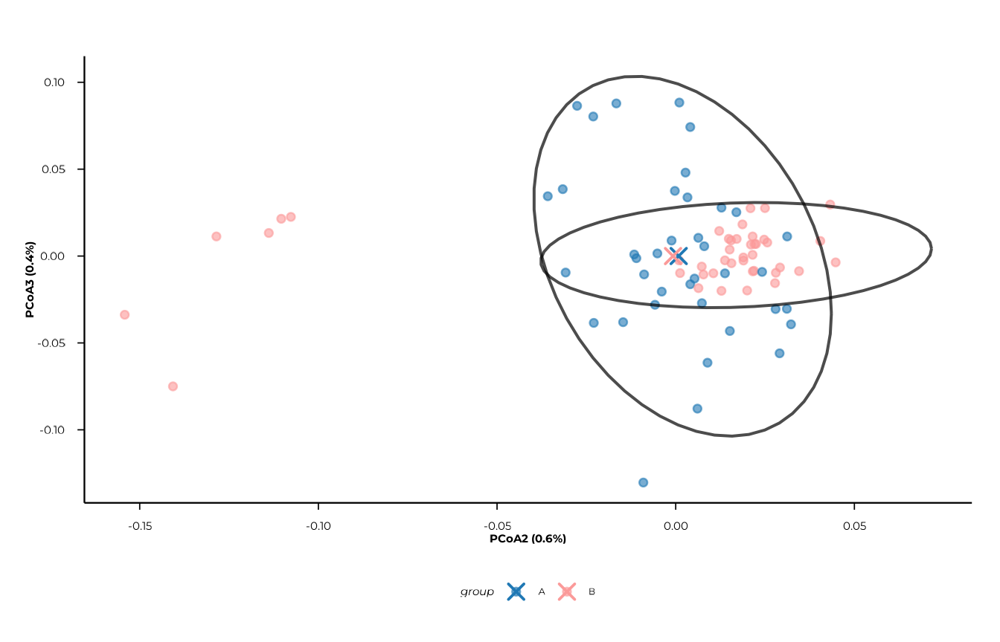

------------------------------------------------------------------------

## Step 3 — Constrained ordination (CAP / db-RDA)

Constrained ordination asks: **how much of the distance structure is
explained by known metadata variables?**
[`compute_capscale()`](https://polymerase3.github.io/phiper/reference/compute_capscale.md)
wraps
[`vegan::capscale()`](https://vegandevs.github.io/vegan/reference/dbrda.html)
(distance-based RDA) and runs per-term permutation tests via
[`vegan::anova.cca()`](https://vegandevs.github.io/vegan/reference/anova.cca.html).

``` r

cap_res <- compute_capscale(
  dist_obj     = d,
  ps           = pd,
  formula      = ~ group + timepoint,
  permutations = 99L
)
#> [12:08:15] INFO  building metadata from `ps$data_long`.
#> [12:08:15] INFO  fitting constrained ordination (cap/db-rda)
#>                    - formula: ~group + timepoint
#> [12:08:16] INFO  extracting constrained sample scores.
#> [12:08:16] INFO  computing variance partitioning and permutation tests.
#> [12:08:16] INFO  computing feature associations: weighted_average.
#> [12:08:16] INFO  cap analysis complete.

cap_res$variance_partition
#> # A tibble: 3 × 3
#>   component     inertia proportion
#>   <chr>           <dbl>      <dbl>
#> 1 Total           22.4       1    
#> 2 Constrained     17.2       0.767
#> 3 Unconstrained    5.23      0.233

cat(
  "R\u00b2 =", round(cap_res$r2, 3),
  "| adj. R\u00b2 =", round(cap_res$r2_adj, 3), "\n"
)
#> R² = 0.767 | adj. R² = 0.761

cap_res$perm_terms
#> # A tibble: 3 × 5
#>   term         Df SumOfSqs       F `Pr(>F)`
#>   <chr>     <dbl>    <dbl>   <dbl>    <dbl>
#> 1 group         1  17.1    252.        0.01
#> 2 timepoint     1   0.0676   0.995     0.48
#> 3 Residual     77   5.23    NA        NA
```

The `variance_partition` tibble shows how much of the total inertia is
constrained by the formula terms vs. left unconstrained. `perm_terms`
gives the per-variable permutation test results.

### Plotting CAP

As with PCoA, join metadata into `cap_res$sample_coords` before
plotting:

``` r

cap_res$sample_coords <- left_join(
  cap_res$sample_coords,
  meta,
  by = "sample_id"
)
```

``` r

plot_cap(
  cap_res,
  group_col         = "group",
  time_col          = "time",
  centroid_by       = "group_time",
  connect_centroids = "group",
  ellipse_by        = "group"
)
#> [12:08:16] INFO  CAP plot: n=80 samples | groups=2 | times=0
#>                  -> plot_cap
```

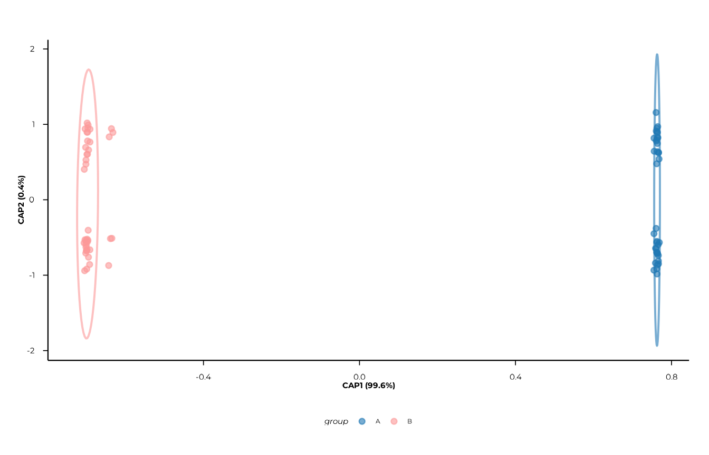

[`plot_cap()`](https://polymerase3.github.io/phiper/reference/plot_cap.md)
accepts the same `axes`, `centroid_by`, `connect_centroids`, and
`ellipse_by` arguments as
[`plot_pcoa()`](https://polymerase3.github.io/phiper/reference/plot_pcoa.md).

------------------------------------------------------------------------

## Step 4 — PERMANOVA

PERMANOVA (permutational ANOVA) tests whether group centroids differ
significantly in multivariate distance space.
[`compute_permanova()`](https://polymerase3.github.io/phiper/reference/compute_permanova.md)
runs a global model and all pairwise post-hoc contrasts, with optional
BH adjustment within each contrast scope.

``` r

perm_res <- compute_permanova(
  dist_obj     = d,
  ps           = pd,
  group_col    = "group",
  time_col     = "timepoint",
  subject_col  = "subject_id",
  permutations = 99L,
  p_adjust     = "BH"
)
#> [12:08:16] INFO  preparing distance labels and metadata.
#> [12:08:16] INFO  building metadata from `ps`.
#> [12:08:16] INFO  filtering samples with missing grouping variables.
#> [12:08:16] INFO  subsetting distance matrix to complete cases.
#> [12:08:16] INFO  preparing global permanova model.
#> [12:08:16] INFO  running global permanova
#>                    - model: d_resp ~ group + timepoint + group * timepoint
#>                    - permutations stratified by subject
#> [12:08:16] INFO  running pairwise permanova contrasts.

perm_res
#> # A tibble: 5 × 8
#>   scope          contrast term            F_stat      R2 p_value p_adjust n_perm
#>   <chr>          <chr>    <chr>            <dbl>   <dbl>   <dbl>    <dbl>  <int>
#> 1 global         <global> group          252.    0.764      0.01     0.03     99
#> 2 global         <global> timepoint        0.995 0.00302    0.39     0.51     99
#> 3 global         <global> group:timepoi…   0.990 0.00300    0.51     0.51     99
#> 4 group_pairwise B vs A   group          252.    0.763      0.01     0.01     99
#> 5 time_pairwise  T1 vs T2 timepoint        0.995 0.00302    0.38     0.38     99
```

The `scope` column distinguishes three levels of inference:

| `scope`            | Meaning                                       |
|--------------------|-----------------------------------------------|
| `"global"`         | Full model (group, time, interaction)         |
| `"group_pairwise"` | All pairwise comparisons between group levels |
| `"time_pairwise"`  | All pairwise comparisons between time levels  |

`p_adjust` is applied **within** each scope separately, so global and
pairwise p-values are adjusted independently.

> **Repeated measures.** When `subject_col` is provided and subjects
> appear at multiple timepoints, permutations for time contrasts are
> stratified by subject. This is a simplified approximation; complex
> longitudinal designs may require custom permutation schemes via
> [`permute::how()`](https://rdrr.io/pkg/permute/man/how.html).

------------------------------------------------------------------------

## Step 5 — Beta dispersion

PERMANOVA assumes homogeneous within-group dispersion (equal spread
around centroids). If groups differ in dispersion rather than in
location, a significant PERMANOVA result can be misleading.
[`compute_dispersion()`](https://polymerase3.github.io/phiper/reference/compute_dispersion.md)
tests this assumption using
[`vegan::betadisper()`](https://vegandevs.github.io/vegan/reference/betadisper.html)
and
[`vegan::permutest()`](https://vegandevs.github.io/vegan/reference/anova.cca.html).

``` r

disp_res <- compute_dispersion(
  dist_obj     = d,
  ps           = pd,
  group_col    = "group",
  time_col     = "timepoint",
  permutations = 99L,
  p_adjust     = "BH"
)
#> [12:08:17] INFO  preparing distance labels and metadata.
#> [12:08:17] INFO  building metadata from `ps`.
#> [12:08:17] INFO  filtering samples with missing grouping variables.
#> [12:08:17] INFO  computing global dispersion tests.
#> [12:08:17] INFO  running pairwise dispersion contrasts.

disp_res$tests        # permutation test results per scope
#> # A tibble: 3 × 6
#>   scope      contrast term       p_value p_adjust n_perm
#>   <chr>      <chr>    <chr>        <dbl>    <dbl>  <int>
#> 1 group      <global> dispersion    0.56     0.56     99
#> 2 time       <global> dispersion    0.9      0.9      99
#> 3 group:time <global> dispersion    0.74     0.74     99
head(disp_res$distances)  # per-sample distances to centroid
#> # A tibble: 6 × 5
#>   sample_id distance level scope contrast
#>   <chr>        <dbl> <chr> <chr> <chr>   
#> 1 B_T1_1       0.248 B     group <global>
#> 2 A_T1_1       0.266 A     group <global>
#> 3 B_T2_1       0.249 B     group <global>
#> 4 A_T2_1       0.253 A     group <global>
#> 5 B_T1_10      0.254 B     group <global>
#> 6 A_T1_10      0.274 A     group <global>
```

The returned object is of class `"beta_dispersion"` and contains two
tibbles:

| Component    | Content                                              |
|--------------|------------------------------------------------------|
| `$tests`     | Permutation test p-values per scope and contrast     |
| `$distances` | Per-sample distance-to-centroid, scope, and contrast |

### Plotting dispersion

[`plot_dispersion()`](https://polymerase3.github.io/phiper/reference/plot_dispersion.md)
overlays violins, boxplots, and jittered points. Select a `scope` and
`contrast` that appear in `disp_res$distances`.

#### Group dispersion

``` r

plot_dispersion(
  disp_res,
  scope    = "group",
  contrast = "<global>"
)
#> [12:08:17] INFO  Plotting dispersion for scope = 'group', contrast = '<global>'
#>                  (n = 80).
#>                  -> plot_dispersion
```

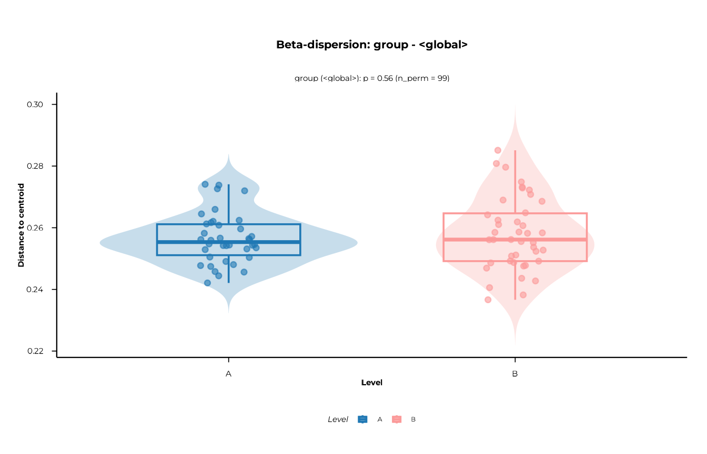

#### Time dispersion

``` r

plot_dispersion(
  disp_res,
  scope    = "time",
  contrast = "<global>"
)
#> [12:08:18] INFO  Plotting dispersion for scope = 'time', contrast = '<global>'
#>                  (n = 80).
#>                  -> plot_dispersion
```

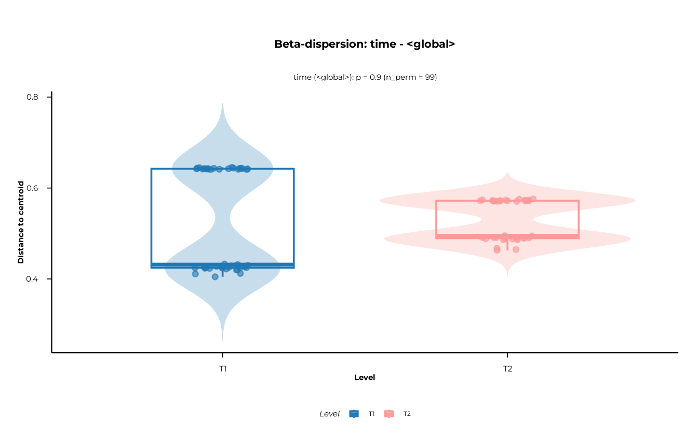

Layer visibility is controlled individually:

``` r

plot_dispersion(
  disp_res,
  scope       = "group",
  contrast    = "<global>",
  show_violin = FALSE,
  show_box    = TRUE,
  show_points = TRUE
)
#> [12:08:18] INFO  Plotting dispersion for scope = 'group', contrast = '<global>'
#>                  (n = 80).
#>                  -> plot_dispersion
```

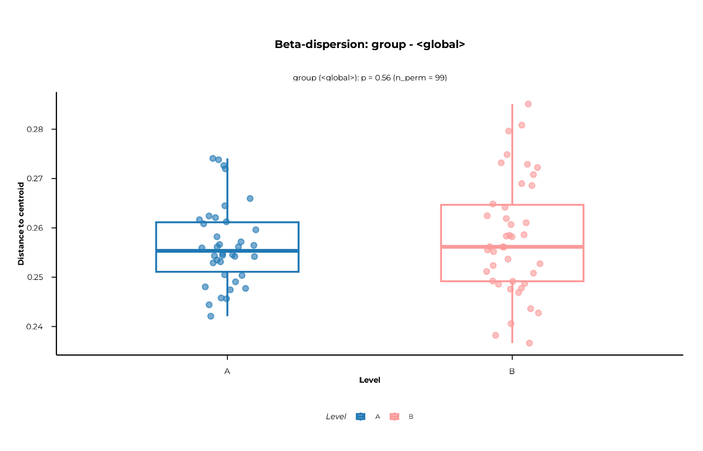

------------------------------------------------------------------------

## Step 6 — t-SNE

t-SNE is a non-linear embedding method that preserves local
neighbourhood structure. It is useful for spotting clusters that linear
methods miss. **Axes are not interpretable** and embeddings vary with
the random seed and the `perplexity` parameter — always set a `seed`.

``` r

tsne_res <- compute_tsne(
  ps         = pd,
  dist_obj   = d,
  dims       = 3L,         # compute 3 dimensions for both 2D and 3D views
  perplexity = 15,
  meta_cols  = c("group", "timepoint"),
  seed       = 42L
)
#> [12:08:19] INFO  Running t-SNE with dims = 3, perplexity = 15 on 80 samples
#>                  (distance input).
#> [12:08:19] INFO  Attaching metadata columns to t-SNE result: group, timepoint
#> [12:08:19] INFO  t-SNE embedding computation finished.

head(tsne_res)
#> # A tibble: 6 × 6
#>   sample_id  tSNE1 tSNE2  tSNE3 group timepoint
#>   <chr>      <dbl> <dbl>  <dbl> <chr> <chr>    
#> 1 B_T1_1    -11.6  -27.2 -10.9  B     T1       
#> 2 A_T1_1     14.5   29.4  15.8  A     T1       
#> 3 B_T2_1    -11.8  -30.6 -12.8  B     T2       
#> 4 A_T2_1      9.13  30.7   9.58 A     T2       
#> 5 B_T1_10   -11.3  -33.4 -11.4  B     T1       
#> 6 A_T1_10    12.1   26.7  15.1  A     T1
attr(tsne_res, "tsne_params")
#> $dims
#> [1] 3
#> 
#> $perplexity
#> [1] 15
#> 
#> $theta
#> [1] 0.5
#> 
#> $max_iter
#> [1] 1000
#> 
#> $seed
#> [1] 42
#> 
#> $check_dup
#> [1] FALSE
#> 
#> $call
#> compute_tsne(ps = pd, dist_obj = d, dims = 3L, perplexity = 15, 
#>     meta_cols = c("group", "timepoint"), seed = 42L)
```

### 2D plot

``` r

plot_tsne(tsne_res, view = "2d", colour = "group")
#> [12:08:19] INFO  Creating 2D t-SNE plot (ggplot2).
#>                  -> plot_tsne
```

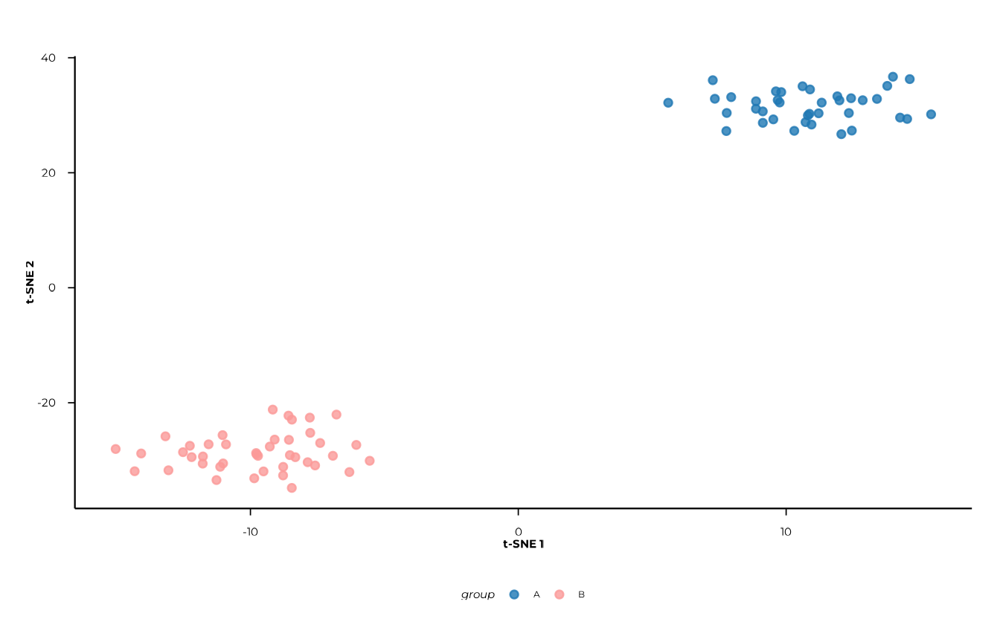

``` r

plot_tsne(tsne_res, view = "2d", colour = "timepoint")
#> [12:08:19] INFO  Creating 2D t-SNE plot (ggplot2).
#>                  -> plot_tsne
```

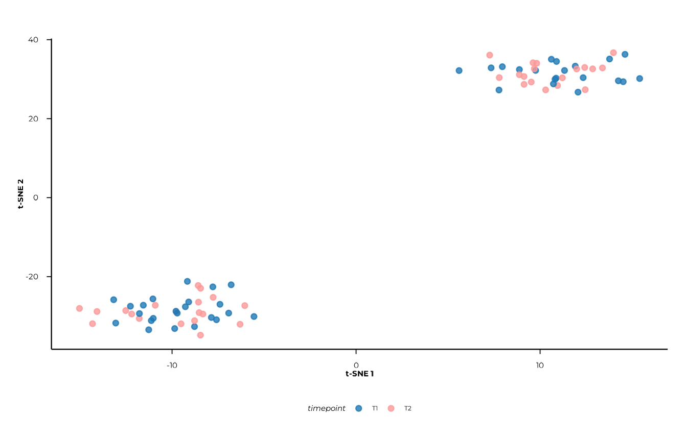

Axis labels (`t-SNE 1`, `t-SNE 2`) carry no quantitative meaning — do
not read them the way you would PCoA axes.

### 3D interactive plot

`view = "3d"` returns a `plotly` widget. It is best explored
interactively in an HTML report or the RStudio viewer.

``` r

plot_tsne(tsne_res, view = "3d", colour = "group")
```

------------------------------------------------------------------------

## Putting it all together

A complete beta diversity analysis from data object to inference:

``` r

library(phiper)
library(dplyr)

pd   <- load_example_data()
meta <- pd$data_long |> select(sample_id, subject_id, group, timepoint) |> distinct() |> collect()

# 1. Distances
d <- compute_distance(pd, value_col = "fold_change",
                      method_normalization = "hellinger", distance = "bray")

# 2. PCoA
pcoa_res <- compute_pcoa(d, n_axes = 5L)
plot_scree(pcoa_res)
pcoa_res$sample_coords <- left_join(pcoa_res$sample_coords, meta, by = "sample_id")
plot_pcoa(pcoa_res, group_col = "group", time_col = "time",
          centroid_by = "group_time", connect_centroids = "group")

# 3. Feature associations
compute_pcoa_feature_associations(d, pcoa_res, top_features = 30L)

# 4. CAP
cap_res <- compute_capscale(d, ps = pd, formula = ~ group + timepoint,
                             permutations = 999L)
cap_res$perm_terms
cap_res$sample_coords <- left_join(cap_res$sample_coords, meta, by = "sample_id")
plot_cap(cap_res, group_col = "group", time_col = "time")

# 5. PERMANOVA
compute_permanova(d, ps = pd, group_col = "group", time_col = "time",
                  subject_col = "subject_id", permutations = 999L, p_adjust = "BH")

# 6. Dispersion
disp_res <- compute_dispersion(d, ps = pd, group_col = "group", time_col = "time",
                                permutations = 999L, p_adjust = "BH")
disp_res$tests
plot_dispersion(disp_res, scope = "group", contrast = "<global>")

# 7. t-SNE
tsne_res <- compute_tsne(pd, d, dims = 3L, perplexity = 15, seed = 42L,
                          meta_cols = c("group", "timepoint"))
plot_tsne(tsne_res, view = "2d", colour = "group")
plot_tsne(tsne_res, view = "3d", colour = "group")
```

------------------------------------------------------------------------

## Session info

``` r

sessionInfo()
#> R version 4.6.1 (2026-06-24)
#> Platform: x86_64-pc-linux-gnu
#> Running under: Ubuntu 24.04.4 LTS
#> 
#> Matrix products: default
#> BLAS:   /usr/lib/x86_64-linux-gnu/openblas-pthread/libblas.so.3 
#> LAPACK: /usr/lib/x86_64-linux-gnu/openblas-pthread/libopenblasp-r0.3.26.so;  LAPACK version 3.12.0
#> 
#> locale:
#>  [1] LC_CTYPE=C.UTF-8       LC_NUMERIC=C           LC_TIME=C.UTF-8       
#>  [4] LC_COLLATE=C.UTF-8     LC_MONETARY=C.UTF-8    LC_MESSAGES=C.UTF-8   
#>  [7] LC_PAPER=C.UTF-8       LC_NAME=C              LC_ADDRESS=C          
#> [10] LC_TELEPHONE=C         LC_MEASUREMENT=C.UTF-8 LC_IDENTIFICATION=C   
#> 
#> time zone: UTC
#> tzcode source: system (glibc)
#> 
#> attached base packages:
#> [1] stats     graphics  grDevices utils     datasets  methods   base     
#> 
#> other attached packages:
#> [1] dplyr_1.2.1  phiper_0.4.4
#> 
#> loaded via a namespace (and not attached):
#>  [1] tidyr_1.3.2        utf8_1.2.6         sass_0.4.10        generics_0.1.4    
#>  [5] lattice_0.22-9     digest_0.6.39      magrittr_2.0.5     evaluate_1.0.5    
#>  [9] grid_4.6.1         RColorBrewer_1.1-3 sysfonts_0.8.9     showtextdb_3.0    
#> [13] blob_1.3.0         fastmap_1.2.0      Matrix_1.7-5       jsonlite_2.0.0    
#> [17] DBI_1.3.0          mgcv_1.9-4         purrr_1.2.2        scales_1.4.0      
#> [21] permute_0.9-10     textshaping_1.0.5  jquerylib_0.1.4    duckdb_1.5.5      
#> [25] cli_3.6.6          rlang_1.3.0        chk_0.11.0         dbplyr_2.6.0      
#> [29] phiperio_0.5.5     splines_4.6.1      withr_3.0.3        cachem_1.1.0      
#> [33] yaml_2.3.12        vegan_2.7-6        otel_0.2.0         Rtsne_0.17        
#> [37] parallel_4.6.1     tools_4.6.1        ggplot2_4.0.3      showtext_0.9-8    
#> [41] vctrs_0.7.3        R6_2.6.1           lifecycle_1.0.5    fs_2.1.0          
#> [45] htmlwidgets_1.6.4  MASS_7.3-65        cluster_2.1.8.2    ragg_1.5.2        
#> [49] pkgconfig_2.0.3    desc_1.4.3         pkgdown_2.2.1      RcppParallel_6.2.1
#> [53] pillar_1.11.1      bslib_0.12.0       gtable_0.3.6       glue_1.8.1        
#> [57] Rcpp_1.1.2         systemfonts_1.3.2  xfun_0.60          tibble_3.3.1      
#> [61] tidyselect_1.2.1   knitr_1.52         farver_2.1.2       nlme_3.1-169      
#> [65] htmltools_0.5.9    labeling_0.4.3     parallelDist_0.2.7 rmarkdown_2.32    
#> [69] compiler_4.6.1     S7_0.2.2
```
