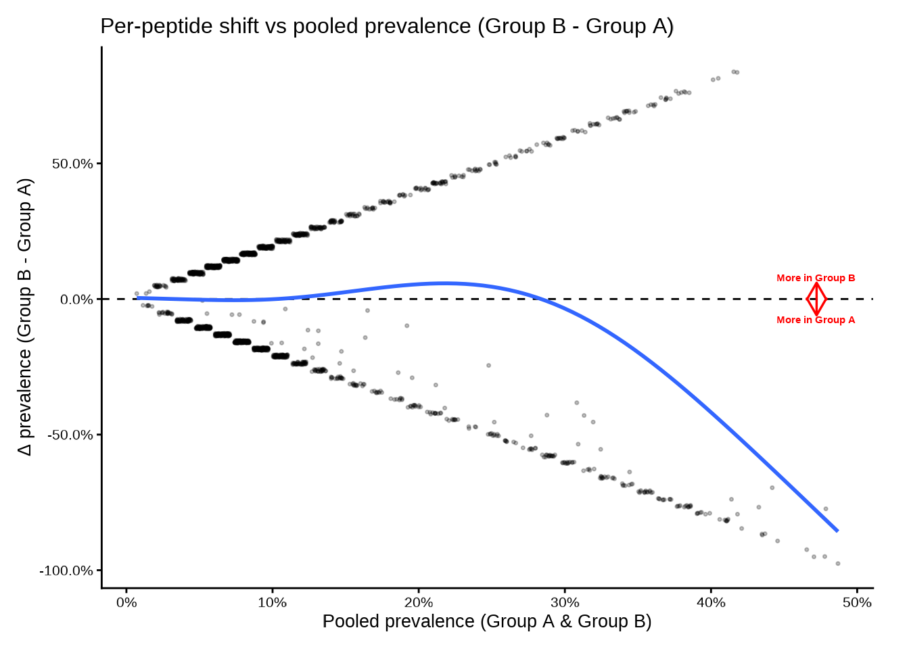
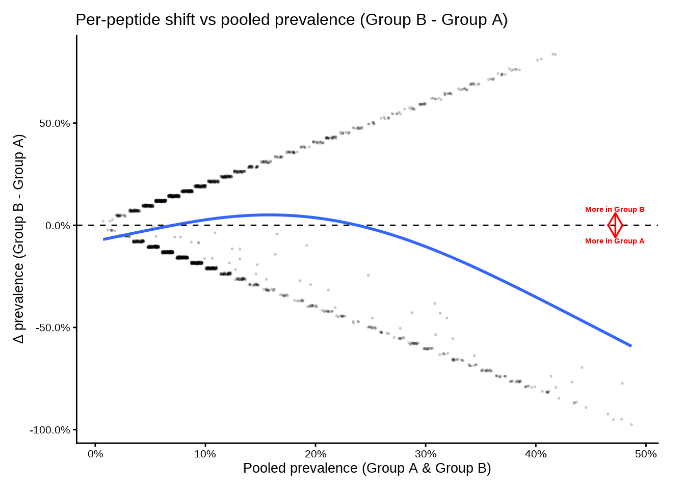
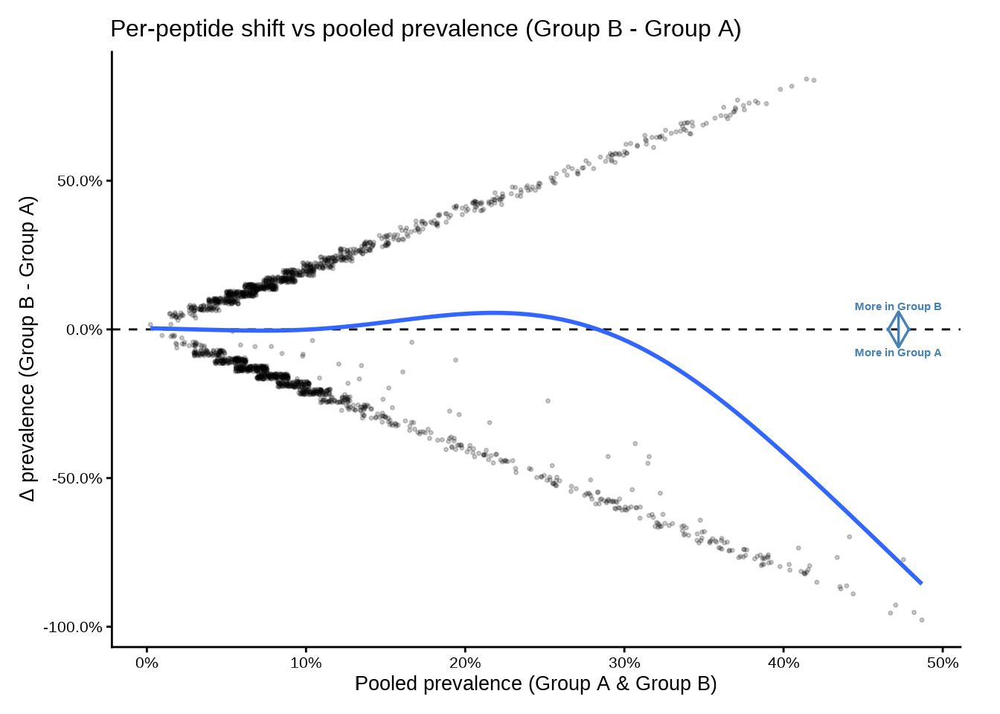
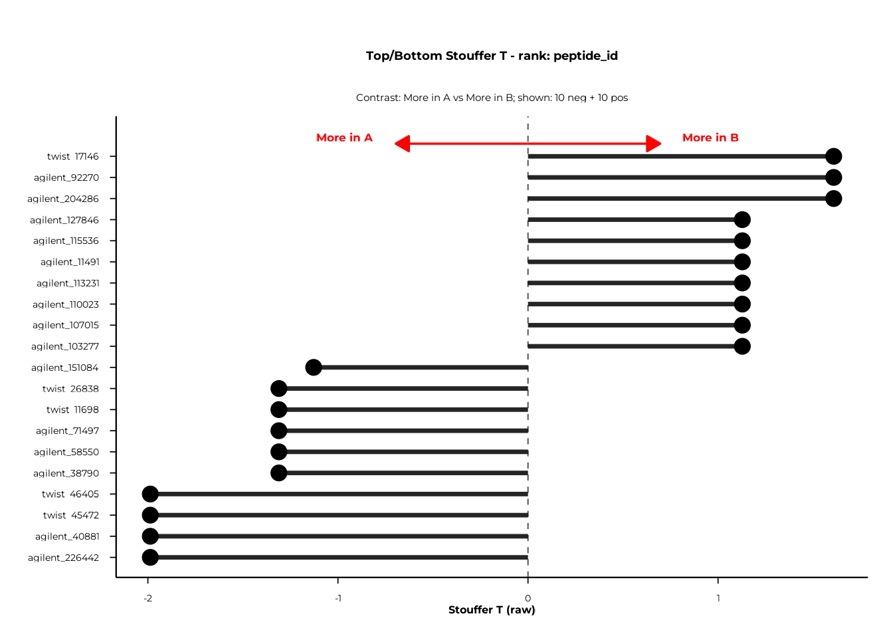
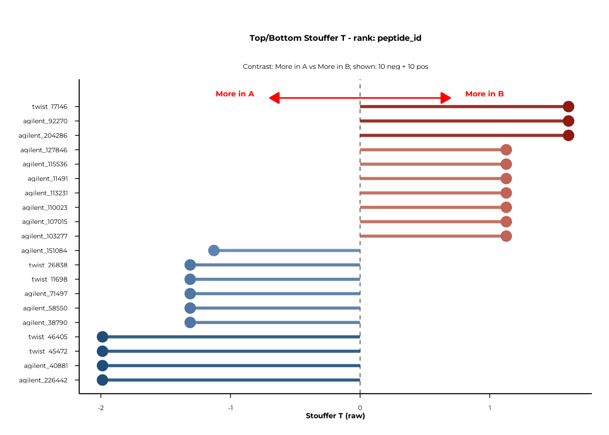

# Delta Analysis in PhIP-seq

## Overview

The Delta framework answers two related but distinct questions about
peptide-level prevalence:

1.  **Where do peptides shift?** —
    [`deltaplot()`](https://polymerase3.github.io/phiper/reference/deltaplot.md)
    and
    [`deltaplot_interactive()`](https://polymerase3.github.io/phiper/reference/deltaplot_interactive.md)
    place each peptide at its pooled prevalence (x) and prevalence shift
    Δ (y), providing a global view of which features move between
    groups.
2.  **Is there a statistically significant global shift?** —
    [`compute_delta()`](https://polymerase3.github.io/phiper/reference/compute_delta.md)
    aggregates per-peptide z-scores into a single Stouffer-type
    statistic and assesses significance via subject-label permutation.
    [`forestplot()`](https://polymerase3.github.io/phiper/reference/forestplot.md)
    and
    [`forestplot_interactive()`](https://polymerase3.github.io/phiper/reference/forestplot_interactive.md)
    then display the top and bottom features ranked by that statistic.

This vignette walks through the complete Delta workflow in **phiper**:

1.  Visualising raw prevalence shift with
    [`deltaplot()`](https://polymerase3.github.io/phiper/reference/deltaplot.md)
    and
    [`deltaplot_interactive()`](https://polymerase3.github.io/phiper/reference/deltaplot_interactive.md)
2.  Running the permutation test with
    [`compute_delta()`](https://polymerase3.github.io/phiper/reference/compute_delta.md)
3.  Displaying results with
    [`forestplot()`](https://polymerase3.github.io/phiper/reference/forestplot.md)
    and
    [`forestplot_interactive()`](https://polymerase3.github.io/phiper/reference/forestplot_interactive.md)

------------------------------------------------------------------------

## Setup

``` r

library(phiper)
```

Load the bundled example dataset. It contains two patient groups (`A`,
`B`) measured at two timepoints (`T1`, `T2`) across 1 000 simulated
peptides.

``` r

pd <- load_example_data()
#> [11:57:45] INFO  Constructing <phip_data> object
#>                  -> create_data()
#> [11:57:45] INFO  Fetching peptide metadata library via get_peptide_library()
#> [11:57:45] INFO  Retrieving peptide metadata into DuckDB cache
#>                  -> get_peptide_library(force_refresh = FALSE)
#> [11:57:46] INFO  Opened DuckDB connection
#>                    - cache dir:
#>                      /home/runner/.cache/R/phiperio/peptide_meta/phip_cache.duckdb
#>                    - table: peptide_meta
#> [11:57:46] OK    Using cached download (SHA-256 match)
#> [11:57:48] OK    Download complete and loaded into R
#> [11:57:52] INFO  Importing sanitized metadata into DuckDB cache...
#> [11:57:54] OK    peptide_meta table created in DuckDB cache
#> [11:57:54] OK    Retrieving peptide metadata into DuckDB cache - done
#>                  -> elapsed: 8.466s
#> [11:57:54] OK    Peptide metadata acquired
#> [11:57:54] INFO  Validating <phip_data>
#>                  -> validate_phip_data()
#> [11:57:54] INFO  Checking structural requirements (shape & mandatory columns)
#> [11:57:54] INFO  Checking outcome family availability (exist / fold_change /
#>                  raw_counts)
#> [11:57:54] INFO  Checking collisions with reserved names
#>                    - subject_id, sample_id, timepoint, peptide_id, exist,
#>                      fold_change, counts_input, counts_hit
#> [11:57:54] INFO  Ensuring all columns are atomic (no list-cols)
#> [11:57:54] INFO  Checking key uniqueness
#> [11:57:54] INFO  Validating value ranges & types for outcomes
#> [11:57:54] INFO  Assessing sparsity (NA/zero prevalence vs threshold)
#>                    - warn threshold: 50%
#> [11:57:54] INFO  Checking peptide_id coverage against peptide_library
#> [11:57:54] INFO  Checking full grid completeness (peptide * sample)
#> [11:57:54] INFO  Counts table is not a full peptide * sample grid
#>                    - observed rows: 78200
#>                    - expected rows: 156000
#> [11:57:54] OK    Validating <phip_data> - done
#>                  -> elapsed: 0.392s
#> [11:57:54] OK    Constructing <phip_data> object - done
#>                  -> elapsed: 8.861s
pd
#> ── <phip_data> ───────────────────────────────────────────────────────────────── 
#> 
#> counts (first 5 rows): 
#> # A tibble: 5 × 9
#>   sample_id subject_id group timepoint peptide_id     exist counts_control
#>   <chr>     <chr>      <chr> <chr>     <chr>          <int>          <int>
#> 1 B_T1_1    1          B     T1        agilent_100642     0             16
#> 2 B_T1_1    1          B     T1        agilent_100997     1             18
#> 3 B_T1_1    1          B     T1        agilent_10133      0             15
#> 4 B_T1_1    1          B     T1        agilent_101516     0             29
#> 5 B_T1_1    1          B     T1        agilent_101615     0             16
#> # ℹ 2 more variables: counts_hits <int>, fold_change <dbl>
#> 
#> table size: 78,200 rows x 9 columns
#> 
#> peptide library preview (first 5 rows): 
#> # A tibble: 5 × 8
#>   peptide_id    Fullname                 species genus family order class common
#>   <chr>         <chr>                    <chr>   <chr> <chr>  <chr> <chr> <chr> 
#> 1 agilent_1     Chromodomain-helicase-D… Homo s… Homo  Homin… Prim… Mamm… Human 
#> 2 agilent_10    Lipase 2 precursor (Gly… Staphy… Stap… Staph… Baci… Baci… NA    
#> 3 agilent_100   cell surface protein pr… Porphy… Porp… Porph… Bact… Bact… NA    
#> 4 agilent_1000  Coagulation factor VIII… Homo s… Homo  Homin… Prim… Mamm… Human 
#> 5 agilent_10000 transmembrane serine/th… Mycoba… Myco… Mycob… Myco… Acti… NA    
#> ... plus 37 more columns
#> 
#> library size: 357,190 rows x 45 columns
#> 
#> meta flags: 
#>   con:            <duckdb_connection>
#>   longitudinal:   TRUE
#>   exist:          TRUE
#>   fold_change:    TRUE
#>   raw_counts:     FALSE
#>   extra_cols:     group, counts_control, counts_hits
#>   peptide_con:    <duckdb_connection>
#>   materialise_table: TRUE
#>   finalizer_env:  <environment>
#>   full_cross:     FALSE
```

> **Note.** The example data are entirely simulated and have no
> biological meaning. They exist solely to demonstrate the API.

The Delta plots consume prevalence tables produced by
[`compute_pop()`](https://polymerase3.github.io/phiper/reference/compute_pop.md)
(see the POP vignette for details). Compute a group-level prevalence
table first:

``` r

pop_group <- compute_pop(
  pd,
  rank_cols  = "peptide_id",
  group_cols = "group"
)
#> [11:57:54] INFO  compute_pop
#> [11:57:54] INFO  compute_pop
#>                    - ranks : peptide_id
#>                    - group_cols: group
#>                    - exist_col : exist
#>                    - pop_k_min : 1
#>                    - paired : FALSE
#> [11:57:54] INFO  ranks resolved
#>                    - available: peptide_id
#> [11:57:55] INFO  computing cohort sizes and validating binary group_cols
#> [11:57:55] INFO  computing presence per sample via k-of-n rule
#> [11:57:55] INFO  counting present samples per feature (pop, unpaired)
#> [11:57:55] INFO  building pairwise comparisons
#> [11:57:56] OK    materialized; computing Fisher p-values
#>                    - table: ph_pop_20260909_115755
#> [11:57:57] OK    done (compute_pop, unpaired)
#>                    - rows : 1950
#>                    - ranks : peptide_id
#>                    - k_min : 1
#> [11:57:57] OK    compute_pop - done
#>                  -> elapsed: 2.206s
head(pop_group)
#>         rank        feature group_col group1 n1 N1 prop1 percent1 group2 n2 N2
#> 1 peptide_id agilent_100642     group      A  0 38     0        0      B  8 42
#> 2 peptide_id agilent_100997     group      A  0 38     0        0      B  6 42
#> 3 peptide_id  agilent_10133     group      A  0 38     0        0      B  5 42
#> 4 peptide_id agilent_101516     group      A  0 38     0        0      B 17 42
#> 5 peptide_id agilent_101615     group      A  0 38     0        0      B  9 42
#> 6 peptide_id agilent_101998     group      A  0 38     0        0      B 11 42
#>       prop2 percent2      ratio delta_ratio        p_raw n_peptides
#> 1 0.1904762 19.04762 0.06907895   -6.238095 5.758809e-03          1
#> 2 0.1428571 14.28571 0.09210526   -4.428571 2.664380e-02          1
#> 3 0.1190476 11.90476 0.11052632   -3.523810 5.626494e-02          1
#> 4 0.4047619 40.47619 0.03250774  -14.380952 2.792824e-06          1
#> 5 0.2142857 21.42857 0.06140351   -7.142857 2.625712e-03          1
#> 6 0.2619048 26.19048 0.05023923   -8.952381 5.233874e-04          1
```

For the unpaired group comparison with
[`compute_delta()`](https://polymerase3.github.io/phiper/reference/compute_delta.md),
each subject must appear at most once per group. Because `pd` contains
two timepoints per subject, restrict to a single timepoint first:

``` r

pd_t1 <- pd |> dplyr::filter(timepoint == "T1") |> dplyr::collect()
```

------------------------------------------------------------------------

## Visualising prevalence shift

### `deltaplot()` — static ggplot2

[`deltaplot()`](https://polymerase3.github.io/phiper/reference/deltaplot.md)
plots each peptide at:

- **x-axis** — pooled prevalence `(prop1 + prop2) / 2`
- **y-axis** — prevalence shift `prop2 − prop1`

A dashed horizontal line marks Δ = 0. Arrows and labels indicate the
direction of enrichment. A GAM smooth (controlled by `add_smooth`)
summarises the trend across pooled prevalence.

The only required input is a data frame containing `group1`, `group2`,
`prop1`, and `prop2` — which is exactly what
[`compute_pop()`](https://polymerase3.github.io/phiper/reference/compute_pop.md)
returns.

``` r

deltaplot(
  pop_group,
  group_pair_values = c("A", "B"),
  group_labels      = c("Group A", "Group B")
)
#> [11:57:57] INFO  Preparing delta prevalence plot.
```



Use `group_pair_values` to select a specific contrast when the table
contains more than one pair. `group_labels` provides display names for
the axis annotations.

#### Adjusting the smooth

The smooth uses a GAM with basis dimension `smooth_k`. Lower values
produce smoother curves; set `add_smooth = FALSE` to suppress it.

``` r

deltaplot(
  pop_group,
  group_pair_values  = c("A", "B"),
  group_labels       = c("Group A", "Group B"),
  smooth_k           = 3,
  point_alpha        = 0.15,
  point_size         = 0.4
)
#> [11:57:58] INFO  Preparing delta prevalence plot.
```



#### Jitter and appearance

``` r

deltaplot(
  pop_group,
  group_pair_values   = c("A", "B"),
  group_labels        = c("Group A", "Group B"),
  point_jitter_width  = 0.01,
  point_jitter_height = 0.01,
  point_alpha         = 0.20,
  arrow_color         = "steelblue"
)
#> [11:57:59] INFO  Preparing delta prevalence plot.
```



### `deltaplot_interactive()` — plotly

The interactive version mirrors the static API. Hovering over a point
shows the feature identifier, group-level counts and percentages, and
p-value.

``` r

deltaplot_interactive(
  pop_group,
  group_pair_values = c("A", "B"),
  group_labels      = c("Group A", "Group B")
)
```

Disable the smooth if you have few peptides or want a cleaner display:

``` r

deltaplot_interactive(
  pop_group,
  group_pair_values = c("A", "B"),
  group_labels      = c("Group A", "Group B"),
  add_smooth        = FALSE,
  point_size        = 5,
  point_alpha       = 0.5
)
```

------------------------------------------------------------------------

## Testing global shift: `compute_delta()`

[`compute_delta()`](https://polymerase3.github.io/phiper/reference/compute_delta.md)
performs a permutation test for a global (antigen-wide) shift in
prevalence between two groups. For each `(rank, feature)` stratum it
computes a per-peptide z-score, aggregates them via a Stouffer
statistic, and assesses significance by permuting subject labels.

### Unpaired design — group comparison

``` r

set.seed(42)
delta_group <- compute_delta(
  pd_t1,
  rank_cols      = "peptide_id",
  group_cols     = "group",
  B_permutations = 2000L
)
```

``` r

delta_group
#> # A tibble: 1,950 × 19
#>    rank       feature        group_col group1 group2 design   n_subjects_paired
#>    <chr>      <chr>          <chr>     <chr>  <chr>  <chr>                <int>
#>  1 peptide_id agilent_100642 group     A      B      unpaired                NA
#>  2 peptide_id agilent_100997 group     A      B      unpaired                NA
#>  3 peptide_id agilent_10133  group     A      B      unpaired                NA
#>  4 peptide_id agilent_101516 group     A      B      unpaired                NA
#>  5 peptide_id agilent_101615 group     A      B      unpaired                NA
#>  6 peptide_id agilent_101998 group     A      B      unpaired                NA
#>  7 peptide_id agilent_102297 group     A      B      unpaired                NA
#>  8 peptide_id agilent_102300 group     A      B      unpaired                NA
#>  9 peptide_id agilent_102431 group     A      B      unpaired                NA
#> 10 peptide_id agilent_102806 group     A      B      unpaired                NA
#> # ℹ 1,940 more rows
#> # ℹ 12 more variables: n_peptides_used <int>, m_eff <dbl>, T_obs <dbl>,
#> #   T_null_mean <dbl>, T_null_sd <dbl>, T_obs_stand <dbl>, Z_from_p <dbl>,
#> #   p_perm <dbl>, b <int>, max_delta <dbl>, frac_delta_pos <dbl>,
#> #   frac_delta_pos_w <dbl>
```

### What’s in the output?

| Column              | Description                                          |
|---------------------|------------------------------------------------------|
| `rank`              | Rank at which the feature is defined                 |
| `feature`           | Feature identifier                                   |
| `group_col`         | Name of the grouping column                          |
| `group1`, `group2`  | The two groups compared                              |
| `design`            | `"paired"` or `"unpaired"`                           |
| `n_subjects_paired` | Paired subjects used (or `NA` for unpaired)          |
| `n_peptides_used`   | Peptides contributing to the test                    |
| `m_eff`             | Effective number of peptides after weighting         |
| `T_obs`             | Observed Stouffer-type test statistic                |
| `p_perm`            | Two-sided permutation p-value                        |
| `b`                 | Number of permutations actually used                 |
| `max_delta`         | Maximum absolute peptide-level prevalence difference |
| `frac_delta_pos`    | Unweighted fraction of positive peptide-level deltas |
| `frac_delta_pos_w`  | Weighted fraction of positive peptide-level deltas   |

### Choosing the per-peptide statistic

`stat_mode` controls how each peptide’s z-score is computed:

| `stat_mode`        | Description                                 |
|--------------------|---------------------------------------------|
| `"srlr"` (default) | Signed root likelihood ratio                |
| `"diff"`           | Wald-type z: Δ / SE                         |
| `"asin"`           | Arcsine-transformed z (variance-stabilised) |
| `"score"`          | Pooled score z (2×2 score test)             |
| `"mcnemar"`        | Signed McNemar z — paired designs only      |
| `"srlr_paired"`    | Signed root deviance — paired designs only  |

``` r

# Arcsine-transformed statistic
delta_asin <- compute_delta(
  pd,
  rank_cols      = "peptide_id",
  group_cols     = "group",
  stat_mode      = "asin",
  B_permutations = 2000L
)
```

### Aggregation and stratification

`aggregate_stat` controls how peptide-level z-scores are combined:

- `"stouffer"` (default) — weighted Stouffer combination
- `"maxmean"` — mean of the dominant direction
- `"af"` — absolute fraction

`strat_bins` bins peptides by pooled prevalence before aggregation. The
default bins `c(0.002, 0.005, ..., 0.50)` stratify across the prevalence
range so that low- and high-prevalence peptides are treated separately.
Set `strat_bins = 0` for a single global statistic without
stratification.

``` r

# No stratification
delta_nostrat <- compute_delta(
  pd,
  rank_cols      = "peptide_id",
  group_cols     = "group",
  strat_bins     = 0,
  B_permutations = 2000L
)

# Custom bins
delta_custom <- compute_delta(
  pd,
  rank_cols      = "peptide_id",
  group_cols     = "group",
  strat_bins     = c(0.05, 0.25, 0.50),
  B_permutations = 2000L
)
```

### Weighting

`weight_mode` controls peptide weights in the Stouffer statistic:

- `"equal"` (default) — all peptides weight 1
- `"se_invvar"` — inverse-SE weights (downweights noisy peptides)
- `"n_eff_sqrt"` — square root of expected positives (emphasises common
  peptides)

``` r

delta_invvar <- compute_delta(
  pd,
  rank_cols      = "peptide_id",
  group_cols     = "group",
  weight_mode    = "se_invvar",
  B_permutations = 2000L
)
```

### Paired design — timepoint comparison

When the same subjects are measured at two timepoints, set `paired_by`
to the subject-linking column and `stat_mode` to a paired statistic. The
function then performs sign-flipping permutations instead of label
shuffling.

``` r

set.seed(42)
delta_paired <- compute_delta(
  pd,
  rank_cols      = "peptide_id",
  group_cols     = "timepoint",
  paired_by      = "subject_id",
  stat_mode      = "srlr_paired",
  B_permutations = 2000L
)
delta_paired
#> # A tibble: 1,946 × 19
#>    rank       feature        group_col group1 group2 design n_subjects_paired
#>    <chr>      <chr>          <chr>     <chr>  <chr>  <chr>              <int>
#>  1 peptide_id agilent_100642 timepoint T1     T2     paired                21
#>  2 peptide_id agilent_100997 timepoint T1     T2     paired                21
#>  3 peptide_id agilent_10133  timepoint T1     T2     paired                21
#>  4 peptide_id agilent_101516 timepoint T1     T2     paired                21
#>  5 peptide_id agilent_101615 timepoint T1     T2     paired                21
#>  6 peptide_id agilent_101998 timepoint T1     T2     paired                21
#>  7 peptide_id agilent_102297 timepoint T1     T2     paired                21
#>  8 peptide_id agilent_102300 timepoint T1     T2     paired                21
#>  9 peptide_id agilent_102431 timepoint T1     T2     paired                21
#> 10 peptide_id agilent_102806 timepoint T1     T2     paired                21
#> # ℹ 1,936 more rows
#> # ℹ 12 more variables: n_peptides_used <int>, m_eff <dbl>, T_obs <dbl>,
#> #   T_null_mean <dbl>, T_null_sd <dbl>, T_obs_stand <dbl>, Z_from_p <dbl>,
#> #   p_perm <dbl>, b <int>, max_delta <dbl>, frac_delta_pos <dbl>,
#> #   frac_delta_pos_w <dbl>
```

------------------------------------------------------------------------

## Forest plots

Forest plots display the most extreme positive and negative features for
a chosen rank, sorted by the selected test statistic.

### `forestplot()` — static ggplot2

``` r

forestplot(
  delta_group,
  rank_of_interest  = "peptide_id",
  statistic_to_plot = "T",
  n_neg_each        = 10,
  n_pos_each        = 10,
  left_label        = "More in A",
  right_label       = "More in B"
)$plot
```



`statistic_to_plot` selects what is plotted on the x-axis:

| Value | Description |
|----|----|
| `"T"` | Raw `T_obs` from [`compute_delta()`](https://polymerase3.github.io/phiper/reference/compute_delta.md) |
| `"T_stand"` | Permutation-standardised T (requires `T_obs_stand` column) |
| `"Z_from_p"` | Signed Z derived from permutation p-values (requires `Z_from_p`) |

#### Diverging colours

Set `use_diverging_colors = TRUE` to shade bars from blue (negative) to
red (positive):

``` r

forestplot(
  delta_group,
  rank_of_interest     = "peptide_id",
  statistic_to_plot    = "T",
  n_neg_each           = 10,
  n_pos_each           = 10,
  left_label           = "More in A",
  right_label          = "More in B",
  use_diverging_colors = TRUE
)$plot
```



#### Filtering to significant features

Pass a column name to `filter_significant` to restrict the plot to
features below a given significance threshold. With `p_perm` this
retains only permutation-significant features.

``` r

forestplot(
  delta_group,
  rank_of_interest   = "peptide_id",
  statistic_to_plot  = "T",
  filter_significant = "p_perm",
  sig_level          = 0.05,
  left_label         = "More in A",
  right_label        = "More in B"
)$plot
```

### `forestplot_interactive()` — plotly

The interactive version mirrors the static API and returns a plotly
widget. Hovering over a bar shows the feature identifier and statistic
value.

``` r

forestplot_interactive(
  delta_group,
  rank_of_interest     = "peptide_id",
  statistic_to_plot    = "T",
  n_neg_each           = 10,
  n_pos_each           = 10,
  left_label           = "More in A",
  right_label          = "More in B",
  use_diverging_colors = TRUE
)$plot
```

------------------------------------------------------------------------

## Putting it all together

A typical Delta analysis runs in four steps:

``` r

# 1. Compute prevalence (needed for deltaplot)
pop <- compute_pop(
  pd,
  rank_cols  = "peptide_id",
  group_cols = "group"
)

# 2. Visualise raw shift
deltaplot(pop, group_pair_values = c("A", "B"),
          group_labels = c("Group A", "Group B"))
deltaplot_interactive(pop, group_pair_values = c("A", "B"),
                      group_labels = c("Group A", "Group B"))

# 3. Permutation test (unpaired)
set.seed(42)
delta <- compute_delta(
  pd,
  rank_cols      = "peptide_id",
  group_cols     = "group",
  B_permutations = 2000L
)

# Optional: paired test across timepoints
delta_paired <- compute_delta(
  pd,
  rank_cols      = "peptide_id",
  group_cols     = "timepoint",
  paired_by      = "subject_id",
  stat_mode      = "srlr_paired",
  B_permutations = 2000L
)

# 4. Forest plots
forestplot(delta, rank_of_interest = "peptide_id",
           left_label = "More in A", right_label = "More in B")$plot
forestplot_interactive(delta, rank_of_interest = "peptide_id",
                       left_label = "More in A",
                       right_label = "More in B")$plot
```

------------------------------------------------------------------------

## Session info

``` r

sessionInfo()
#> R version 4.6.1 (2026-06-24)
#> Platform: x86_64-pc-linux-gnu
#> Running under: Ubuntu 24.04.4 LTS
#> 
#> Matrix products: default
#> BLAS:   /usr/lib/x86_64-linux-gnu/openblas-pthread/libblas.so.3 
#> LAPACK: /usr/lib/x86_64-linux-gnu/openblas-pthread/libopenblasp-r0.3.26.so;  LAPACK version 3.12.0
#> 
#> locale:
#>  [1] LC_CTYPE=C.UTF-8       LC_NUMERIC=C           LC_TIME=C.UTF-8       
#>  [4] LC_COLLATE=C.UTF-8     LC_MONETARY=C.UTF-8    LC_MESSAGES=C.UTF-8   
#>  [7] LC_PAPER=C.UTF-8       LC_NAME=C              LC_ADDRESS=C          
#> [10] LC_TELEPHONE=C         LC_MEASUREMENT=C.UTF-8 LC_IDENTIFICATION=C   
#> 
#> time zone: UTC
#> tzcode source: system (glibc)
#> 
#> attached base packages:
#> [1] stats     graphics  grDevices utils     datasets  methods   base     
#> 
#> other attached packages:
#> [1] phiper_0.4.5
#> 
#> loaded via a namespace (and not attached):
#>  [1] future_1.75.0       tidyr_1.3.2         utf8_1.2.6         
#>  [4] sass_0.4.10         generics_0.1.4      lattice_0.22-9     
#>  [7] listenv_1.0.0       digest_0.6.39       magrittr_2.0.5     
#> [10] evaluate_1.0.5      grid_4.6.1          RColorBrewer_1.1-3 
#> [13] sysfonts_0.8.9      showtextdb_3.0      blob_1.3.0         
#> [16] fastmap_1.2.0       Matrix_1.7-5        jsonlite_2.0.0     
#> [19] DBI_1.3.0           mgcv_1.9-4          purrr_1.2.2        
#> [22] scales_1.4.0        codetools_0.2-20    textshaping_1.0.5  
#> [25] jquerylib_0.1.4     duckdb_1.5.5        cli_3.6.6          
#> [28] rlang_1.3.0         chk_0.11.0          dbplyr_2.6.0       
#> [31] phiperio_0.5.5      future.apply_1.20.2 parallelly_1.48.0  
#> [34] splines_4.6.1       withr_3.0.3         cachem_1.1.0       
#> [37] yaml_2.3.12         otel_0.2.0          parallel_4.6.1     
#> [40] tools_4.6.1         dplyr_1.2.1         ggplot2_4.0.3      
#> [43] showtext_0.9-8      globals_0.19.1      vctrs_0.7.3        
#> [46] R6_2.6.1            lifecycle_1.0.5     fs_2.1.0           
#> [49] htmlwidgets_1.6.4   ragg_1.5.2          pkgconfig_2.0.3    
#> [52] desc_1.4.3          pkgdown_2.2.1       RcppParallel_6.2.1 
#> [55] pillar_1.11.1       bslib_0.12.0        gtable_0.3.6       
#> [58] glue_1.8.1          Rcpp_1.1.2          systemfonts_1.3.2  
#> [61] xfun_0.60           tibble_3.3.1        tidyselect_1.2.1   
#> [64] knitr_1.52          farver_2.1.2        nlme_3.1-169       
#> [67] htmltools_0.5.9     labeling_0.4.3      rmarkdown_2.32     
#> [70] compiler_4.6.1      S7_0.2.2
```
