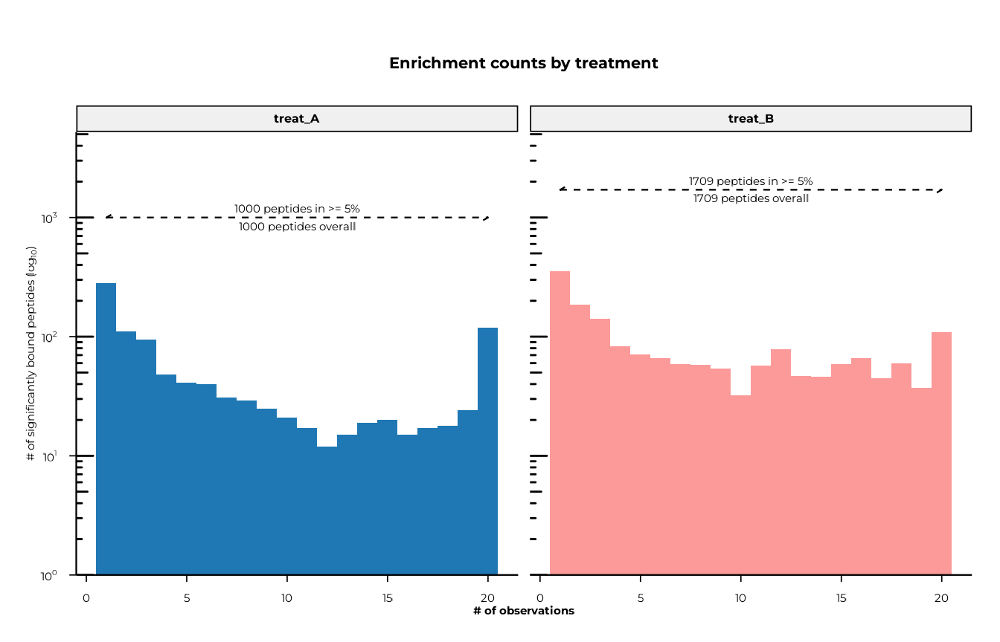
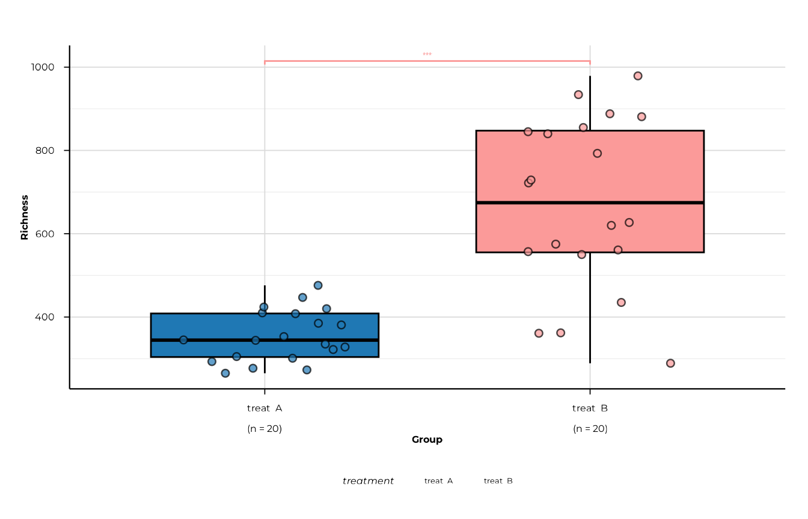
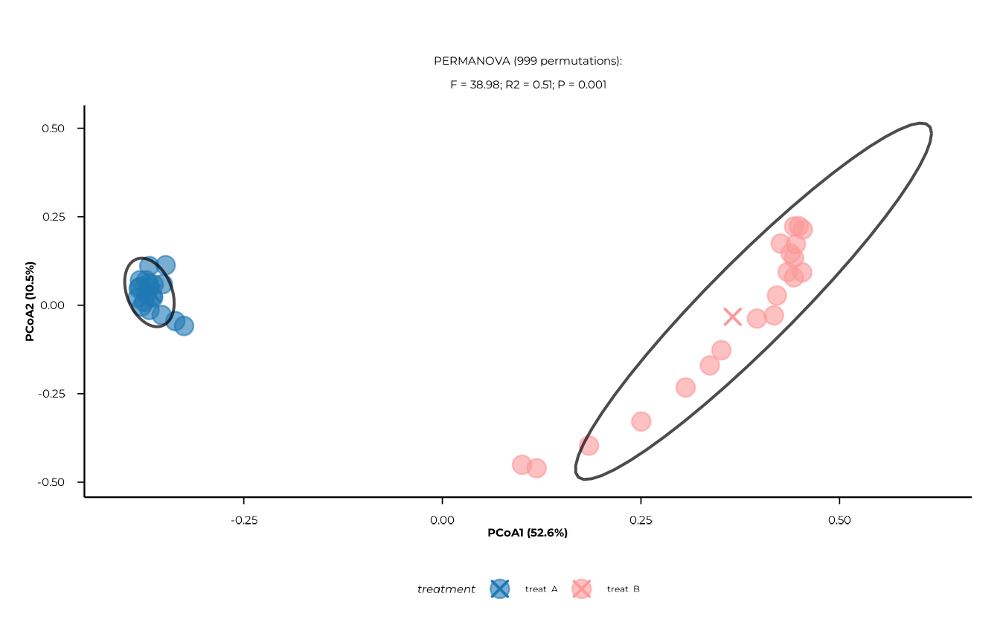

# Tutorial: Typical phiper workflow

## General idea

This tutorial is supposed to provide an exemplary workflow for a
cross-sectional analysis of unpaired PhIP-Seq data using the `phiper`
package. It’s supposed to serve as a railing along `phiper`’s individual
modules to help you get started. It’s not meant as a comprehensive
collection of all features.

For instructions to install `phiper`, please consult the
[documentation](https://polymerase3.github.io/phiper/index.html).

`phiper`’s modules are explained in detail on their own documentation
pages, linked here where appropriate. All of `phiper`’s functions also
come with their own help page, so please call `?function_name` for
focused usage instructions.

We provide a dummy dataset for you to play with and we use it here to
showcase `phiper`’s analysis and plotting functions.

## Load packages

You will want to start by loading the necessary packages. `phiperio`
handles input/output of phiper-related data, while `phiper` contains
functions for analysis and plotting. We also use `dplyr` and `ggplot2`
here for quality of life.

``` r

library(phiperio)
library(phiper)
library(dplyr)
library(ggplot2)
```

## Load data

Next, you will need to load your data. There are different ways to do
this. For details, please consult `phiperio`’s [Github
repository](https://github.com/Polymerase3/phiperio). For this tutorial
we assume that you have received a set of `.csv` files (one for each
sample), containing a list of enriched peptides.

Note that peptides which didn’t show enrichment within a sample will not
be listed in that sample’s `.csv` file.

Please save the entire set of `.csv` files that you want to load into
one folder. Then `phiperio`’s
[`convert_standard()`](https://polymerase3.github.io/phiperio/reference/convert_standard.html)
can batch-import them into a `phip-data` object.
[`convert_standard()`](https://polymerase3.github.io/phiperio/reference/convert_standard.html)
can also be used to load a `.parquet` file.

For this tutorial, we have prepared a dummy dataset bundled with the
package. Load it like so:

``` r

vig_dir <- system.file("extdata/typical-workflow", package = "phiper")

pd <- convert_standard(
  data_long_path = file.path(vig_dir, "enrichment_files"),
  peptide_id = "ID",                   # column in the .csv files for peptide IDs
  sample_id_from_filenames = TRUE,     # use file names as sample IDs
  auto_expand = TRUE                   # expand to include all library peptides
)
#> [12:15:58] INFO  Constructing <phip_data> object
#>                  -> create_data()
#> [12:15:58] INFO  Fetching peptide metadata library via get_peptide_library()
#> [12:15:58] INFO  Retrieving peptide metadata into DuckDB cache
#>                  -> get_peptide_library(force_refresh = FALSE)
#> [12:15:58] INFO  Opened DuckDB connection
#>                    - cache dir:
#>                      /home/runner/.cache/R/phiperio/peptide_meta/phip_cache.duckdb
#>                    - table: peptide_meta
#> [12:15:58] OK    Using cached download (SHA-256 match)
#> [12:16:01] OK    Download complete and loaded into R
#> [12:16:05] INFO  Importing sanitized metadata into DuckDB cache...
#> [12:16:07] OK    peptide_meta table created in DuckDB cache
#> [12:16:07] OK    Retrieving peptide metadata into DuckDB cache - done
#>                  -> elapsed: 9.566s
#> [12:16:07] OK    Peptide metadata acquired
#> [12:16:07] INFO  Validating <phip_data>
#>                  -> validate_phip_data()
#> [12:16:07] INFO  Checking structural requirements (shape & mandatory columns)
#> [12:16:07] INFO  Checking outcome family availability (exist / fold_change /
#>                  raw_counts)
#> [12:16:07] INFO  Checking collisions with reserved names
#>                    - subject_id, sample_id, timepoint, peptide_id, exist,
#>                      fold_change, counts_input, counts_hit
#> [12:16:07] INFO  Ensuring all columns are atomic (no list-cols)
#> [12:16:07] INFO  Checking key uniqueness
#> [12:16:07] INFO  Validating value ranges & types for outcomes
#> [12:16:07] INFO  Assessing sparsity (NA/zero prevalence vs threshold)
#>                    - warn threshold: 50%
#> [12:16:07] INFO  Checking peptide_id coverage against peptide_library
#> [12:16:08] INFO  Checking full grid completeness (peptide * sample)
#> [12:16:08] INFO  Counts table is not a full peptide * sample grid
#>                    - observed rows: 20495
#>                    - expected rows: 89000
#> [12:16:08] INFO  Auto-expanding to full grid via expand_data()
#>                    - add_exist = TRUE
#>                    - exist_col = "exist"
#> [12:16:08] INFO  Expanding <phip_data> to full grid
#>                  -> updating x$data_long
#> [12:16:08] INFO  Expanding to full key * id grid
#>                  -> keys: 'sample_id'; id: 'peptide_id'
#> [12:16:08] INFO  Type probe on lazy table
#>                  -> collect(head 0)
#> [12:16:08] INFO  Building Cartesian product of keys and ids
#> [12:16:08] INFO  Detecting per-key constant (recyclable) columns
#>                    - candidates: fold_change, neglogp, padj, input, count
#> [12:16:08] OK    Column split decided
#>                    - recyclable: <none>
#>                    - non-recyclable: fold_change, neglogp, padj, input, count
#> [12:16:08] INFO  Preparing fill defaults for introduced rows
#>                    - numeric/integer: fold_change, neglogp, padj, input, count
#>                    - logical: <none>
#> [12:16:08] INFO  Applying user-provided fill overrides
#>                    - overrides: exist, fold_change, input_count, hit_count,
#>                      counts_input, counts_hit
#> [12:16:08] INFO  Adding existence flag column
#>                    - column: "exist"
#> [12:16:08] OK    Expanding to full key * id grid - done
#>                  -> elapsed: 0.159s
#> [12:16:09] INFO  Registering expanded table back to DB
#>                    - name: 'data_long'
#>                    - materialise_table: TRUE
#> [12:16:09] INFO  Registering lazy table
#>                  -> name: 'data_long'; as TABLE
#> [12:16:09] INFO  Materialising via dplyr::compute()
#> [12:16:09] OK    Registering lazy table - done
#>                  -> elapsed: 0.262s
#> [12:16:09] OK    Expanding <phip_data> to full grid - done
#>                  -> elapsed: 1.245s
#> [12:16:09] OK    Auto-expansion complete; grid is now full
#> [12:16:09] OK    Validating <phip_data> - done
#>                  -> elapsed: 1.611s
#> [12:16:09] OK    Constructing <phip_data> object - done
#>                  -> elapsed: 11.18s
```

Since we are dealing with extremely large tables, `phip_data` objects
rely on DuckDB, so the data is not stored in memory but on disk instead.
Calls and manipulations of this object will be translated into database
queries. This can be a bit awkward at times, but you can basically do
the same types of operations as on regular R objects (e.g.,
[`filter()`](https://dplyr.tidyverse.org/reference/filter.html),
[`select()`](https://dplyr.tidyverse.org/reference/select.html), `%>%`,
etc.). This is how calling this object looks like:

``` r

pd
#> ── <phip_data> ───────────────────────────────────────────────────────────────── 
#> 
#> counts (first 5 rows): 
#> # A tibble: 5 × 8
#>   sample_id peptide_id     fold_change neglogp  padj input count exist
#>   <chr>     <chr>                <dbl>   <dbl> <dbl> <dbl> <dbl> <int>
#> 1 B_11      twist_25378           18.7    7.01 0.03  125      35     1
#> 2 B_11      agilent_2709          14.0    8.31 0.001 272      57     1
#> 3 B_11      agilent_205514        10.6    7.26 0.017 379      60     1
#> 4 B_11      agilent_148372     21338.     9.58 0       0.1    32     1
#> 5 B_20      agilent_196462     13449.     8.20 0.002   0.1    18     1
#> 
#> table size: 89,000 rows x 8 columns
#> 
#> peptide library preview (first 5 rows): 
#> # A tibble: 5 × 8
#>   peptide_id    Fullname                 species genus family order class common
#>   <chr>         <chr>                    <chr>   <chr> <chr>  <chr> <chr> <chr> 
#> 1 agilent_1     Chromodomain-helicase-D… Homo s… Homo  Homin… Prim… Mamm… Human 
#> 2 agilent_10    Lipase 2 precursor (Gly… Staphy… Stap… Staph… Baci… Baci… NA    
#> 3 agilent_100   cell surface protein pr… Porphy… Porp… Porph… Bact… Bact… NA    
#> 4 agilent_1000  Coagulation factor VIII… Homo s… Homo  Homin… Prim… Mamm… Human 
#> 5 agilent_10000 transmembrane serine/th… Mycoba… Myco… Mycob… Myco… Acti… NA    
#> ... plus 37 more columns
#> 
#> library size: 357,190 rows x 45 columns
#> 
#> meta flags: 
#>   con:            <duckdb_connection>
#>   longitudinal:   FALSE
#>   exist:          TRUE
#>   fold_change:    TRUE
#>   raw_counts:     FALSE
#>   extra_cols:     neglogp, padj, input, count
#>   peptide_con:    <duckdb_connection>
#>   materialise_table: TRUE
#>   finalizer_env:  <environment>
#>   full_cross:     TRUE
#>   exist_prop:     0.230280898876404
```

You can extract a regular tibble from a `phip_data` object using
[`collect()`](https://dplyr.tidyverse.org/reference/compute.html), but
larger datasets will have to be filtered down first, as they won’t fit
into memory.

`phip_data` objects also come with annotation information of all
peptides in the library.
[`get_peptide_library()`](https://polymerase3.github.io/phiperio/reference/get_peptide_library.html)
will return a `phip_data` object with these annotations. You may want to
turn that into a tibble for convenient exploration:

``` r

peplib <- get_peptide_library() %>%
  collect()
#> [12:16:09] INFO  Retrieving peptide metadata into DuckDB cache
#>                  -> get_peptide_library(force_refresh = FALSE)
#> [12:16:09] INFO  Opened DuckDB connection
#>                    - cache dir:
#>                      /home/runner/.cache/R/phiperio/peptide_meta/phip_cache.duckdb
#>                    - table: peptide_meta
#> [12:16:09] OK    Using cached download (SHA-256 match)
#> [12:16:12] OK    Download complete and loaded into R
#> [12:16:16] INFO  Importing sanitized metadata into DuckDB cache...
#> [12:16:18] OK    peptide_meta table created in DuckDB cache
#> [12:16:18] OK    Retrieving peptide metadata into DuckDB cache - done
#>                  -> elapsed: 8.635s
```

Let’s now load in the metadata for our samples and include them into our
`pd` object. The metadata for our dummy dataset are entirely fictional.
This metadata table contains a column called `treatment` assigning the
samples into either `treat_A` or `treat_B`. We will be using this column
for comparisons throughout this tutorial. Across different functions,
comparisons are realized by specifying the column name in the
`group_cols` argument (i.e., `group_cols = "treatment"`).

``` r

metadata <- read.delim(file.path(vig_dir, "metadata.txt")) %>%
  tibble()

pd_with_metadata <- left_join(pd, metadata, by = "sample_id", copy = TRUE) # copy = TRUE is necessary because of DuckDB
```

`pd_with_metadata` will be the main input for most of `phiper`’s
functions in this tutorial.

## Alpha diversity

Please refer to the vignette [Alpha Diversity Analysis in
PhIP-seq](https://polymerase3.github.io/phiper/articles/alpha-diversity.html)
for detailed information.

As a first overview, let’s plot the distribution of enriched peptide
counts across our samples.

``` r

p_enrichment_counts <- plot_enrichment_counts(
  pd_with_metadata,
  group_cols = "treatment" # makes a separate panel for each group in this metadata column
)
#> [12:16:19] INFO  Plotting enrichment counts (<phip_data>)
#>                  -> group_cols: 'treatment'
#> [12:16:19] INFO  Full-cross detected; pruning non-existing rows before plotting
#>                    - rule: keep exist == 1
#>                    - estimated reduction: ~4.3x
#> [12:16:19] INFO  building enrichment count plot
#>                  -> grouping variable: 'treatment'
#> [12:16:19] OK    plot built
#> [12:16:19] OK    building enrichment count plot - done
#>                  -> elapsed: 0.333s
#> [12:16:19] OK    Plotting enrichment counts (<phip_data>) - done
#>                  -> elapsed: 0.338s
```

``` r

p_enrichment_counts
```



Now let’s calculate peptide alpha diversities in each sample. We can
also compute global (Kruskal-Wallis) and pair-wise (Wilcoxon)
comparisons and display all of this in a boxplot.

``` r

alpha_div <- compute_alpha(
  pd_with_metadata,
  group_cols = "treatment"
)
#> [12:16:20] INFO  Full-cross detected; pruning non-existing rows before alpha
#>                  calc
#>                    - rule: keep exist == 1
#>                    - estimated reduction: ~4.3x
#> [12:16:20] INFO  Computing alpha diversity (<phip_data>)
#>                  -> group_cols: 'treatment'; ranks: 'peptide_id'
#> [12:16:20] OK    Computing alpha diversity (<phip_data>) - done
#>                  -> elapsed: 0.252s

alpha_sig <- compute_alpha_significance(alpha_div)

p_alpha_richness <- plot_alpha(
  alpha_div,
  metric = "richness",
  group_col = "treatment",
  significance = alpha_sig,
  show_significance = TRUE # needs the package ggsignif
)
#> [12:16:20] INFO  plotting alpha diversity (precomputed)
#>                  -> metric: richness
#> [12:16:20] OK    plotting alpha diversity (precomputed) - done
#>                  -> elapsed: 0.123s
```

``` r

p_alpha_richness
```



## Beta diversity

Please refer to the vignette [Beta Diversity Analysis in
PhIP-seq](https://polymerase3.github.io/phiper/articles/beta-diversity.html)
for detailed information.

Next, let’s calculate between-sample (beta) diversities; Jaccard
dissimilarities in this case. Based on these dissimilarities, we can
easily calculate a PCoA and a PERMANOVA.

``` r

beta_dist <- compute_distance(
  pd_with_metadata,
  distance = "Jaccard"
)
#> [12:16:21] INFO  auto-detected `value_col = "exist"` from `ps`.
#> [12:16:21] INFO  building abundance matrix from `ps` using `exist`.
#> [12:16:21] INFO  building pivot spec (sample_id x peptide_id).
#> [12:16:21] INFO  Collecting long table (sample_id, peptide_id, value).
#>                  -> compute_distance
#> [12:16:21] INFO  Pivoting to wide abundance matrix in R.
#>                  -> compute_distance
#> [12:16:21] INFO  abundance matrix has 40 samples and 2225 features after
#>                  preprocessing.
#> [12:16:21] INFO  auto normalization selected -> using none
#> [12:16:21] INFO  computing distance: jaccard
#> [12:16:22] INFO  distance matrix computation complete.

pcoa <- compute_pcoa(beta_dist)
#> [12:16:22] INFO  performing principal coordinates analysis
#> [12:16:22] INFO  extracting sample coordinates.
#> [12:16:22] INFO  summarizing eigenvalues and variance explained.
#> [12:16:22] INFO  pcoa analysis complete.

# add the treatment column to the coordinate dataframe in order to plot centroids later
pcoa$sample_coords <- pcoa$sample_coords %>%
  left_join(
    pd_with_metadata$data_long %>% select(sample_id, treatment) %>% distinct(),
    by = "sample_id",
    copy = TRUE
  )

permanova <- compute_permanova(
  beta_dist,
  ps = pd_with_metadata,
  group_col = "treatment",
  subject_col = "subject_id"
)
#> [12:16:22] INFO  preparing distance labels and metadata.
#> [12:16:22] INFO  building metadata from `ps`.
#> [12:16:22] INFO  filtering samples with missing grouping variables.
#> [12:16:22] INFO  subsetting distance matrix to complete cases.
#> [12:16:22] INFO  preparing global permanova model.
#> [12:16:22] INFO  running global permanova
#>                    - model: d_resp ~ treatment
#> [12:16:22] INFO  running pairwise permanova contrasts.

permanova_string <- paste0(
  "PERMANOVA (", permanova$n_perm, " permutations):",
  "\nF = ", round(permanova$F_stat, digits = 2),
  "; R2 = ", round(permanova$R2, digits = 2),
  "; P = ", permanova$p_value
)

p_pcoa <- plot_pcoa(
  pcoa,
  axes = c(1, 2),
  group_col = "treatment",
  ellipse_by = "group",
  show_centroids = TRUE,
  point_size = 4
) +
  labs(subtitle = permanova_string)
#> [12:16:22] INFO  Plotting PCoA: n=40 | group_col=treatment | time_col=<none> |
#>                  centroid_by=group
#>                  -> plot_pcoa
```

``` r

p_pcoa
```



## POP

Please refer to the vignette [Prevalence of Presence (POP) Analysis in
PhIP-seq](https://polymerase3.github.io/phiper/articles/pop-analysis.html)
for detailed information.

Comparing prevalences of peptides between two different groups is a
classic way of looking at PhIP-seq data. It’s good for exploration but
please refer to the [DELTA section](#delta) for a proper analysis of
shifts in prevalence using `phiper`’s DELTA module.

You can run POP in different (taxonomic) ranks (see peptide annotation
in the `peplib` variable). For any other ranks than `peptide_id`,
results will be aggregated by that rank. As an example we here run POP
on `peptide_id` and `species`.

``` r

pop <- compute_pop(
  x = pd_with_metadata,
  rank_cols = c("peptide_id", "species"),
  group_cols = "treatment"
) %>% tibble()
#> [12:16:23] INFO  compute_pop
#> [12:16:23] INFO  compute_pop
#>                    - ranks : peptide_id, species
#>                    - group_cols: treatment
#>                    - exist_col : exist
#>                    - pop_k_min : 1
#>                    - paired : FALSE
#> [12:16:23] INFO  ranks resolved
#>                    - available: peptide_id, species
#> [12:16:24] INFO  computing cohort sizes and validating binary group_cols
#> [12:16:24] INFO  computing presence per sample via k-of-n rule
#> [12:16:24] INFO  counting present samples per feature (pop, unpaired)
#> [12:16:24] INFO  building pairwise comparisons
#> [12:16:27] OK    materialized; computing Fisher p-values
#>                    - table: ph_pop_20260909_121624
#> [12:16:28] OK    done (compute_pop, unpaired)
#>                    - rows : 2605
#>                    - ranks : peptide_id, species
#>                    - k_min : 1
#> [12:16:28] OK    compute_pop - done
#>                  -> elapsed: 4.979s
```

Since we have POP data for two different ranks, we can make two separate
plots.

``` r

p_pop_static <- list()
for (rank_name in c("peptide_id", "species")) {

  p_pop_static[[rank_name]] <- scatter_static(
    df = pop,
    rank = rank_name,
    xlab = paste("Prevalence in", unique(pop$group1), "%"),
    ylab = paste("Prevalence in", unique(pop$group2), "%")
  ) +
    labs(title = rank_name)

}
```

You can also create interactive plots with plotly that you can later
save as HTML files.

``` r

p_pop_interactive <- list()
for (rank_name in c("peptide_id", "species")) {

  p_inter_temp <- scatter_interactive(
    df = pop,
    rank = rank_name,
    xlab = paste("Prevalence in", unique(pop$group1), "(%)"),
    ylab = paste("Prevalence in", unique(pop$group2), "(%)"),
    peplib = peplib
  )

  p_pop_interactive[[rank_name]] <- plotly::layout(
    p_inter_temp,
    autosize = TRUE,
    margin   = list(l = 70, r = 30, t = 50, b = 50),
    xaxis    = list(range = c(-2, 102), automargin = TRUE),
    yaxis    = list(range = c(-2, 102), automargin = TRUE),
    title = rank_name
  )

}
```

Let’s display one of the plots as an example:

``` r

p_pop_interactive$species
```

## DELTA

Please refer to the vignette [Delta Analysis in
PhIP-seq](https://polymerase3.github.io/phiper/articles/delta-analysis.html)
for detailed information.

The DELTA module can be computationally quite expensive, so if you have
a large dataset you may want to use the `future` package for
multithreading and run it on a high-performance computer. `future`
doesn’t work in interactive R Studio sessions, though, so we will run it
on one core here.

``` r

delta <- compute_delta(
  x = pd_with_metadata,
  rank_cols = c("peptide_id", "species"),
  group_cols = "treatment",
  B_permutations = 100
) %>%
  filter(m_eff > 5) # highly recommended: results based on fewer than 5 peptides can be unreliable
```

The most common way to visualize these results is by a forest plot to
display the features whose prevalence shifted the most.

``` r

p_delta_static <- list()
p_delta_interactive <- list()
for (rank_name in c("peptide_id", "species")) {

  p_delta_static[[rank_name]] <- forestplot(
    results_tbl = delta,
    rank_of_interest = rank_name,
    use_diverging_colors = TRUE,
    filter_significant = "p_perm",
    left_label = paste0("More in ", unique(delta$group1)),
    right_label = paste0("More in ", unique(delta$group2))
  )

  p_delta_interactive[[rank_name]] <- forestplot_interactive(
    results_tbl = delta,
    rank_of_interest = rank_name,
    use_diverging_colors = TRUE,
    filter_significant = "p_perm",
    left_label = paste0("More in ", unique(delta$group1)),
    right_label = paste0("More in ", unique(delta$group2))
  )

}
```

Let’s again look at one of these plots as an example:

``` r

p_delta_interactive$species$plot
```

## Save output

We assume you already know how to save tables and ggplot objects to
disk. The interactive plots can for example be saved to HTML with
[`htmlwidgets::saveWidget()`](https://rdrr.io/pkg/htmlwidgets/man/saveWidget.html).

`phip_data` objects can be stored as `.parquet` files using `phiperio`’s
[`export_parquet()`](https://polymerase3.github.io/phiperio/reference/export_parquet.html).
