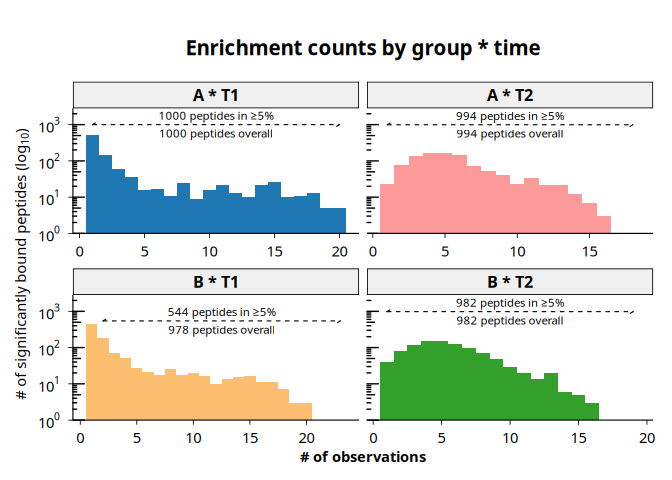
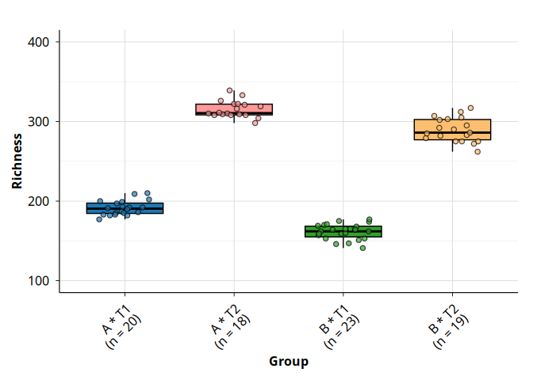

# phiper

The `phiper` package provides a scalable, reproducible toolkit for
validating and analyzing PhIP-Seq data in cross-sectional and
longitudinal studies.

## Installation

You can install the development version of `phiper` from GitHub with
either `pak` or `devtools`:

``` r
# install.packages("pak")
pak::pak("Polymerase3/phiper")

# or, using devtools:
# install.packages("devtools")
devtools::install_github("Polymerase3/phiper")
```

## Usage

For testing, exploration, and minimal examples we provide the
`phip_mixture` dataset. It is a simulated PhIP-Seq–like antibody
repertoire for two groups (A, B) and two time points (T1, T2), with
per-subject, per-peptide presence/absence (`exist`) plus corresponding
read counts and fold changes. The dataset is generated from a simple
mixture of rare and common peptide prevalences with Poisson-distributed
counts and is intended solely for testing and illustrative examples,
without any biological interpretation.

### Importing the data

A ready-to-use example dataset is bundled with `phiperio`. Load it
directly with:

``` r
library(phiper)
library(dplyr)
library(ggplot2)

ps <- load_example_data()
```

You can inspect the data:

``` r
ps$data_long %>%
  head(5) %>%
  collect()
#> # A tibble: 5 × 9
#>   sample_id subject_id group time  peptide_id exist counts_control counts_hits
#>   <chr>     <chr>      <chr> <chr> <chr>      <int>          <int>       <int>
#> 1 A_T1_1    1          A     T1    10003          1              5        1031
#> 2 A_T1_1    1          A     T1    10017          1             37         494
#> 3 A_T1_1    1          A     T1    10023          1             11        3015
#> 4 A_T1_1    1          A     T1    10062          1              0        3499
#> 5 B_T1_1    1          B     T1    10087          1              1        1245
#> # ℹ 1 more variable: fold_change <dbl>
```

You can also inspect the current version of the peptide library
maintained by the Vogl lab:

``` r
get_peptide_library(ps) %>%
  head(5) %>%
  collect()
#> # A tibble: 5 × 30
#>   peptide_id aa_seq    pos len_seq Fullname Description is_IEDB_or_cntrl is_auto
#>   <chr>      <chr>   <dbl>   <dbl> <chr>    <chr>       <lgl>            <lgl>  
#> 1 agilent_1  AAAAAA…  2728    2997 Chromod… Chromodoma… TRUE             TRUE   
#> 2 agilent_2  AAAAYA…    88     445 integra… Uncharacte… TRUE             FALSE  
#> 3 agilent_3  AAADRS…   264     548 hypothe… Possible c… TRUE             FALSE  
#> 4 agilent_4  AAAIAW…  1276    3432 envelop… Genome pol… TRUE             FALSE  
#> 5 agilent_5  AAALRK…  1188    1935 Myosin-… Myosin-7    TRUE             FALSE  
#> # ℹ 22 more variables: is_infect <lgl>, is_EBV <lgl>, is_toxin <lgl>,
#> #   is_PNP <lgl>, is_EM <lgl>, is_MPA <lgl>, is_patho <lgl>, is_probio <lgl>,
#> #   is_IgA <lgl>, is_flagellum <lgl>, signalp6_slow <lgl>,
#> #   is_topgraph_new <lgl>, is_allergens <lgl>, domain <chr>, kingdom <chr>,
#> #   phylum <chr>, class <chr>, order <chr>, family <chr>, genus <chr>,
#> #   species <chr>, common <chr>
```

### Plotting peptide counts

You can easily plot peptide counts using the
[`plot_enrichment_counts()`](https://polymerase3.github.io/phiper/reference/plot_enrichment_counts.md)
function:

``` r
plot_enrichment_counts(
  ps,
  group_cols        = c("group", "time"),
  group_interaction = TRUE,
  interaction_only  = TRUE,
  annotation_size   = 3
)
#> [15:47:57] INFO  Plotting enrichment counts (<phip_data>)
#>                  -> group_cols: 'group', 'time'
#> [15:47:57] INFO  building enrichment count plot
#>                  -> grouping variable: '..phip_interaction..'
#> [15:47:57] OK    plot built
#> [15:47:57] OK    building enrichment count plot - done
#>                  -> elapsed: 0.151s
#> [15:47:57] OK    Plotting enrichment counts (<phip_data>) - done
#>                  -> elapsed: 0.155s
```



### Alpha diversity

You can also compute and visualize alpha diversity for different groups
or subgroups of interest. `phiper` is organized into analysis modules:
for each module you typically get a computation function (for example,
[`compute_alpha()`](https://polymerase3.github.io/phiper/reference/compute_alpha.md))
and one or more plotting functions (for example,
[`plot_alpha_diversity()`](https://polymerase3.github.io/phiper/reference/plot_alpha_diversity.md)).
This pattern repeats across the analysis modules.

For alpha diversity specifically:

``` r
alpha <- compute_alpha(
  ps,
  group_cols        = c("group", "time"),
  carry_cols        = "subject_id",
  group_interaction = TRUE,
  interaction_only  = TRUE
)
#> [15:47:58] INFO  Peptide library attached on main connection
#>                    - available columns: peptide_id, aa_seq, pos, len_seq,
#>                      Fullname, Description, is_IEDB_or_cntrl, is_auto …(+22)
#> [15:47:58] INFO  Computing alpha diversity (<phip_data>)
#>                  -> group_cols: 'group', 'time'; ranks: 'peptide_id'
#> [15:47:58] OK    Computing alpha diversity (<phip_data>) - done
#>                  -> elapsed: 0.116s

head(alpha)
#> $`group * time`
#> # A tibble: 80 × 7
#>    rank       sample_id phip_interaction subject_id richness simpson_diversity
#>    <chr>      <chr>     <chr>            <chr>         <int>             <dbl>
#>  1 peptide_id B_T1_13   B * T1           13              141             0.993
#>  2 peptide_id A_T2_13   A * T2           13              333             0.997
#>  3 peptide_id B_T2_13   B * T2           13              282             0.996
#>  4 peptide_id B_T2_22   B * T2           22              317             0.997
#>  5 peptide_id B_T2_23   B * T2           23              303             0.997
#>  6 peptide_id B_T1_3    B * T1           3               174             0.994
#>  7 peptide_id B_T2_5    B * T2           5               283             0.996
#>  8 peptide_id A_T1_6    A * T1           6               187             0.995
#>  9 peptide_id B_T1_7    B * T1           7               169             0.994
#> 10 peptide_id A_T2_8    A * T2           8               310             0.997
#> # ℹ 70 more rows
#> # ℹ 1 more variable: shannon_diversity <dbl>
```

You can then plot the results:

``` r
plot_alpha_diversity(
  alpha,
  metric    = "richness",
  group_col = "phip_interaction"
) +
  ylim(100, 400) +
  theme(
    axis.text.x = element_text(
      angle = 45,
      vjust = 1,
      hjust = 1
    )
  )
#> [15:47:58] INFO  plotting alpha diversity (precomputed)
#>                  -> metric: richness
#> [15:47:58] OK    plotting alpha diversity (precomputed) - done
#>                  -> elapsed: 0.073s
```



## Contributing

Bug reports, feature requests, and questions are welcome. Please open an
issue on the GitHub tracker:

- <https://github.com/Polymerase3/phiper/issues>

If you’d like to contribute, please read
[CONTRIBUTING.md](https://polymerase3.github.io/phiper/CONTRIBUTING.md).
